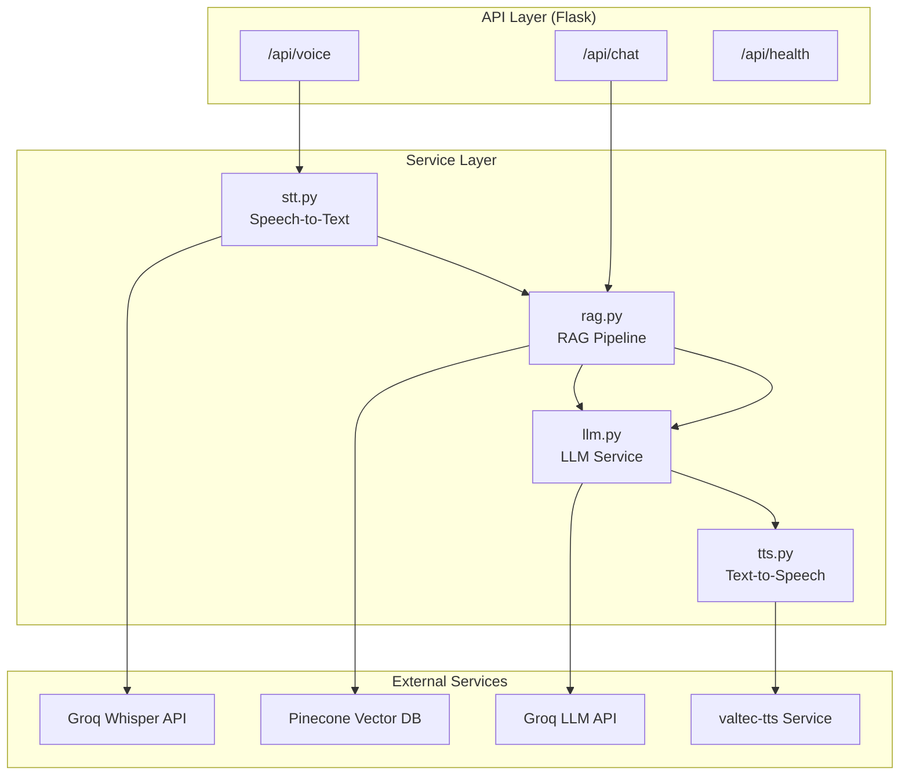
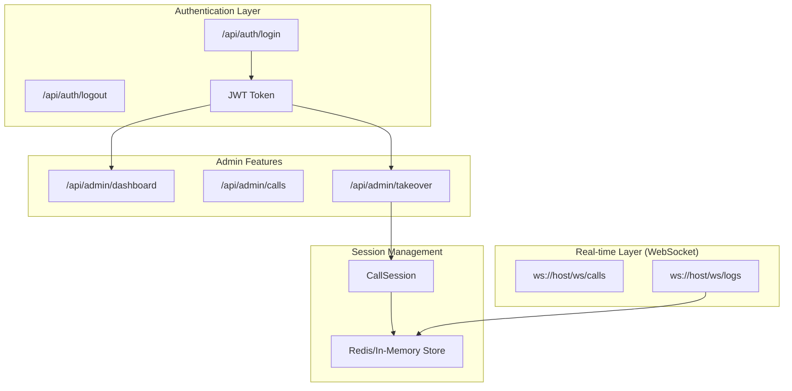

# Backend Implementation Plan - AI Call Center

## Tổng quan

Xây dựng Backend Flask API cho hệ thống AI Call Center với các tính năng:

-   Speech-to-Text (STT) thông qua Groq Whisper
-   RAG Pipeline với Pinecone Vector Database
-   LLM Integration với Groq
-   Text-to-Speech (TTS) với valtec-tts

---

## Kiến trúc Backend



---

## Cấu trúc thư mục

```
backend/
├── app/
│   ├── __init__.py              # Flask app factory
│   ├── config.py                # Configuration management
│   ├── routes/
│   │   ├── __init__.py
│   │   ├── voice.py             # /api/voice endpoint
│   │   ├── chat.py              # /api/chat endpoint
│   │   └── health.py            # /api/health endpoint
│   ├── services/
│   │   ├── __init__.py
│   │   ├── stt.py               # Speech-to-Text service
│   │   ├── tts.py               # Text-to-Speech service
│   │   ├── rag.py               # RAG pipeline service
│   │   └── llm.py               # LLM service
│   └── utils/
│       ├── __init__.py
│       ├── audio.py             # Audio processing utilities
│       └── embeddings.py        # Text embedding utilities
├── scripts/
│   └── ingest_data.py           # Data ingestion script
├── tests/
│   ├── __init__.py
│   ├── test_stt.py
│   ├── test_tts.py
│   ├── test_rag.py
│   ├── test_llm.py
│   └── test_routes.py
├── .env.example                 # Environment variables template
├── requirements.txt             # Python dependencies
├── run.py                       # Application entrypoint
└── README.md
```

---

## Chi tiết Implementation

### Phase 1: Project Setup & Configuration

#### 1.1. Khởi tạo project structure

**[NEW] `backend/requirements.txt`**

```txt
# Core
flask==3.0.0
flask-cors==4.0.0
python-dotenv==1.0.0
gunicorn==21.2.0

# AI/ML Services
groq==0.4.2
pinecone-client==3.0.0
sentence-transformers==2.2.2

# TTS - Vietnamese Text-to-Speech
# Install from git: pip install git+https://github.com/tronghieuit/valtec-tts.git
# Note: requires PyTorch 2.0+, auto-downloads model from HuggingFace
valtec-tts @ git+https://github.com/tronghieuit/valtec-tts.git

# Audio Processing
pydub==0.25.1
numpy==1.26.2
scipy==1.11.4

# HTTP Client
requests==2.31.0
httpx==0.25.2

# Testing
pytest==7.4.3
pytest-asyncio==0.21.1
```

#### 1.2. Configuration Management

**[NEW] `backend/app/config.py`**

```python
import os
from dotenv import load_dotenv

load_dotenv()

class Config:
    # Flask
    FLASK_ENV = os.getenv("FLASK_ENV", "development")
    FLASK_PORT = int(os.getenv("FLASK_PORT", 3724))

    # Groq
    GROQ_API_KEY = os.getenv("GROQ_API_KEY")
    GROQ_STT_MODEL = "whisper-large-v3-turbo"
    GROQ_LLM_MODEL = "openai/gpt-oss-120b"

    # Pinecone
    PINECONE_API_KEY = os.getenv("PINECONE_API_KEY")
    PINECONE_INDEX_NAME = os.getenv("PINECONE_INDEX_NAME", "ai-call-center")

    # TTS - valtec-tts settings
    TTS_DEVICE = os.getenv("TTS_DEVICE", "cpu")  # "cuda" for GPU, "cpu" for CPU
    TTS_DEFAULT_SPEAKER = os.getenv("TTS_DEFAULT_SPEAKER", "NF")  # NF, SF, NM1, NM2, SM
    TTS_DEFAULT_SPEED = float(os.getenv("TTS_DEFAULT_SPEED", "1.0"))

    # Embedding
    EMBEDDING_MODEL = "sentence-transformers/paraphrase-multilingual-MiniLM-L12-v2"
```

#### 1.3. Flask App Factory

**[NEW] `backend/app/__init__.py`**

```python
from flask import Flask
from flask_cors import CORS
from app.config import Config

def create_app():
    app = Flask(__name__)
    app.config.from_object(Config)

    # Enable CORS for frontend
    CORS(app, origins=["http://localhost:3000"])

    # Register blueprints
    from app.routes.voice import voice_bp
    from app.routes.chat import chat_bp
    from app.routes.health import health_bp

    app.register_blueprint(voice_bp, url_prefix="/api")
    app.register_blueprint(chat_bp, url_prefix="/api")
    app.register_blueprint(health_bp, url_prefix="/api")

    return app
```

---

### Phase 2: Service Layer Implementation

#### 2.1. Speech-to-Text Service (STT)

**[NEW] `backend/app/services/stt.py`**

| Function                       | Input                | Output                   | Description                                   |
| ------------------------------ | -------------------- | ------------------------ | --------------------------------------------- |
| `transcribe_audio(audio_file)` | `bytes` (audio data) | `str` (transcribed text) | Gửi audio đến Groq Whisper API và trả về text |

**Implementation Details:**

-   Sử dụng Groq SDK với model `whisper-large-v3-turbo`
-   Hỗ trợ các format: WAV, WebM, MP3, M4A
-   Xử lý error handling cho network issues và API errors
-   Logging để debug

```python
from groq import Groq
from app.config import Config

class STTService:
    def __init__(self):
        self.client = Groq(api_key=Config.GROQ_API_KEY)
        self.model = Config.GROQ_STT_MODEL

    def transcribe(self, audio_file: bytes, filename: str = "audio.wav") -> str:
        """
        Transcribe audio to text using Groq Whisper.

        Args:
            audio_file: Audio bytes
            filename: Original filename with extension

        Returns:
            Transcribed text
        """
        transcription = self.client.audio.transcriptions.create(
            file=(filename, audio_file),
            model=self.model,
            language="vi",  # Vietnamese
            response_format="text"
        )
        return transcription
```

---

#### 2.2. RAG Pipeline Service

**[NEW] `backend/app/services/rag.py`**

| Function               | Input        | Output        | Description                   |
| ---------------------- | ------------ | ------------- | ----------------------------- |
| `embed_text(text)`     | `str`        | `List[float]` | Tạo embedding vector cho text |
| `search(query, top_k)` | `str`, `int` | `List[dict]`  | Tìm kiếm documents liên quan  |
| `get_context(query)`   | `str`        | `str`         | Lấy context để gửi cho LLM    |

**Implementation Details:**

-   Sử dụng `sentence-transformers` với model multilingual
-   Kết nối Pinecone để vector search
-   Trả về top-k documents có relevance score cao nhất
-   Format context theo template phù hợp cho LLM

```python
from pinecone import Pinecone
from sentence_transformers import SentenceTransformer
from app.config import Config

class RAGService:
    def __init__(self):
        self.pc = Pinecone(api_key=Config.PINECONE_API_KEY)
        self.index = self.pc.Index(Config.PINECONE_INDEX_NAME)
        self.embedder = SentenceTransformer(Config.EMBEDDING_MODEL)

    def embed_text(self, text: str) -> list:
        """Generate embedding vector for text."""
        return self.embedder.encode(text).tolist()

    def search(self, query: str, top_k: int = 5) -> list:
        """Search for relevant documents."""
        query_vector = self.embed_text(query)
        results = self.index.query(
            vector=query_vector,
            top_k=top_k,
            include_metadata=True
        )
        return results.matches

    def get_context(self, query: str) -> str:
        """Get formatted context for LLM."""
        matches = self.search(query)
        context_parts = []

        for match in matches:
            metadata = match.metadata
            if "content" in metadata:
                context_parts.append(metadata["content"])

        return "\n\n---\n\n".join(context_parts)
```

---

#### 2.3. LLM Service

**[NEW] `backend/app/services/llm.py`**

| Function                            | Input        | Output | Description                         |
| ----------------------------------- | ------------ | ------ | ----------------------------------- |
| `generate_response(query, context)` | `str`, `str` | `str`  | Tạo câu trả lời từ query và context |

**Implementation Details:**

-   Sử dụng Groq SDK với model `openai/gpt-oss-120b`
-   System prompt được thiết kế cho customer support tiếng Việt
-   Có fallback khi không tìm thấy context
-   Control temperature và max_tokens

```python
from groq import Groq
from app.config import Config

class LLMService:
    def __init__(self):
        self.client = Groq(api_key=Config.GROQ_API_KEY)
        self.model = Config.GROQ_LLM_MODEL

    SYSTEM_PROMPT = """Bạn là trợ lý chăm sóc khách hàng AI của cửa hàng điện thoại.
Nhiệm vụ của bạn là trả lời câu hỏi khách hàng dựa trên thông tin được cung cấp.
Hãy trả lời ngắn gọn, thân thiện và chuyên nghiệp bằng tiếng Việt.
Nếu không tìm thấy thông tin, hãy lịch sự xin lỗi và đề nghị chuyển đến nhân viên hỗ trợ."""

    def generate_response(self, query: str, context: str) -> str:
        """Generate AI response based on query and context."""
        user_message = f"""Thông tin tham khảo:
{context}

Câu hỏi của khách hàng: {query}

Hãy trả lời câu hỏi dựa trên thông tin trên."""

        response = self.client.chat.completions.create(
            model=self.model,
            messages=[
                {"role": "system", "content": self.SYSTEM_PROMPT},
                {"role": "user", "content": user_message}
            ],
            temperature=0.7,
            max_tokens=500
        )

        return response.choices[0].message.content
```

---

#### 2.4. Text-to-Speech Service (TTS)

**[NEW] `backend/app/services/tts.py`**

| Function                         | Input        | Output                   | Description                    |
| -------------------------------- | ------------ | ------------------------ | ------------------------------ |
| `synthesize(text, speaker)`      | `str`, `str` | `bytes` (audio)          | Chuyển text thành audio WAV    |
| `get_audio_array(text, speaker)` | `str`, `str` | `tuple[np.ndarray, int]` | Lấy audio array và sample rate |
| `list_speakers()`                | None         | `List[str]`              | Danh sách speakers available   |

**valtec-tts Library Info:**

-   GitHub: https://github.com/tronghieuit/valtec-tts
-   Installation: `pip install git+https://github.com/tronghieuit/valtec-tts.git`
-   Auto-downloads model từ HuggingFace khi khởi tạo

**Available Speakers:**

| Speaker | Description                          |
| ------- | ------------------------------------ |
| `NF`    | Northern Female (Giọng nữ miền Bắc)  |
| `SF`    | Southern Female (Giọng nữ miền Nam)  |
| `NM1`   | Northern Male 1 (Giọng nam miền Bắc) |
| `NM2`   | Northern Male 2                      |
| `SM`    | Southern Male (Giọng nam miền Nam)   |

**Synthesis Parameters:**

| Parameter       | Default | Description                                      |
| --------------- | ------- | ------------------------------------------------ |
| `speed`         | 1.0     | Tốc độ nói (< 1.0 = nhanh hơn, > 1.0 = chậm hơn) |
| `noise_scale`   | 0.667   | Độ biến thiên trong giọng nói                    |
| `noise_scale_w` | 0.8     | Độ biến thiên thời lượng                         |

**Implementation:**

```python
import io
import wave
import numpy as np
from valtec_tts import TTS
from app.config import Config

class TTSService:
    _instance = None
    _tts = None

    def __new__(cls):
        """Singleton pattern để tránh load model nhiều lần."""
        if cls._instance is None:
            cls._instance = super().__new__(cls)
            cls._tts = TTS(device=Config.TTS_DEVICE)  # "cuda" or "cpu"
        return cls._instance

    def synthesize(
        self,
        text: str,
        speaker: str = "NF",
        speed: float = 1.0
    ) -> bytes:
        """
        Convert text to speech audio bytes (WAV format).

        Args:
            text: Vietnamese text to synthesize
            speaker: Voice to use (NF, SF, NM1, NM2, SM)
            speed: Speech speed (< 1.0 = faster, > 1.0 = slower)

        Returns:
            Audio bytes in WAV format
        """
        # Get audio array
        audio, sample_rate = self._tts.synthesize(text, speaker=speaker, speed=speed)

        # Convert to WAV bytes
        return self._array_to_wav_bytes(audio, sample_rate)

    def get_audio_array(
        self,
        text: str,
        speaker: str = "NF",
        speed: float = 1.0
    ) -> tuple:
        """
        Get audio as numpy array.

        Returns:
            Tuple of (audio_array, sample_rate)
        """
        return self._tts.synthesize(text, speaker=speaker, speed=speed)

    def list_speakers(self) -> list:
        """List available speakers."""
        return self._tts.list_speakers()  # ['NF', 'SF', 'NM1', 'SM', 'NM2']

    def _array_to_wav_bytes(self, audio: np.ndarray, sample_rate: int) -> bytes:
        """Convert numpy audio array to WAV bytes."""
        # Normalize to 16-bit PCM
        audio_int16 = (audio * 32767).astype(np.int16)

        # Create WAV in memory
        buffer = io.BytesIO()
        with wave.open(buffer, 'wb') as wav_file:
            wav_file.setnchannels(1)  # Mono
            wav_file.setsampwidth(2)  # 16-bit
            wav_file.setframerate(sample_rate)
            wav_file.writeframes(audio_int16.tobytes())

        buffer.seek(0)
        return buffer.read()

    def health_check(self) -> bool:
        """Check if TTS is available."""
        try:
            # Quick test synthesis
            _, _ = self._tts.synthesize("test", speaker="NF")
            return True
        except Exception:
            return False
```

**Alternative: Using HuggingFace Spaces API (fallback):**

```python
import requests

class TTSServiceAPI:
    """Fallback TTS using HuggingFace Spaces API."""

    HF_API_URL = "https://valtecai-team-valtec-vietnamese-tts.hf.space/api/synthesize"

    def synthesize(self, text: str, speaker: str = "female") -> bytes:
        """
        Synthesize via HuggingFace API.

        Args:
            text: Vietnamese text
            speaker: "female" or "male"
        """
        response = requests.post(
            self.HF_API_URL,
            json={"text": text, "speaker": speaker},
            timeout=30
        )
        response.raise_for_status()
        return response.content
```

---

### Phase 3: API Routes Implementation

#### 3.1. Voice Endpoint

**[NEW] `backend/app/routes/voice.py`**

```python
from flask import Blueprint, request, Response
from app.services.stt import STTService
from app.services.rag import RAGService
from app.services.llm import LLMService
from app.services.tts import TTSService

voice_bp = Blueprint("voice", __name__)

stt_service = STTService()
rag_service = RAGService()
llm_service = LLMService()
tts_service = TTSService()

@voice_bp.route("/voice", methods=["POST"])
def process_voice():
    """
    Process voice input and return voice response.

    Request: multipart/form-data with 'audio' file
    Response: audio/wav binary
    """
    if "audio" not in request.files:
        return {"error": "No audio file provided"}, 400

    audio_file = request.files["audio"]
    audio_bytes = audio_file.read()
    filename = audio_file.filename or "audio.wav"

    # Step 1: STT - Convert speech to text
    transcribed_text = stt_service.transcribe(audio_bytes, filename)

    # Step 2: RAG - Get relevant context
    context = rag_service.get_context(transcribed_text)

    # Step 3: LLM - Generate response
    response_text = llm_service.generate_response(transcribed_text, context)

    # Step 4: TTS - Convert response to speech
    audio_response = tts_service.synthesize(response_text)

    return Response(
        audio_response,
        mimetype="audio/wav",
        headers={
            "X-Transcription": transcribed_text,
            "X-Response-Text": response_text
        }
    )
```

#### 3.2. Chat Endpoint

**[NEW] `backend/app/routes/chat.py`**

```python
from flask import Blueprint, request, jsonify
from app.services.rag import RAGService
from app.services.llm import LLMService

chat_bp = Blueprint("chat", __name__)

rag_service = RAGService()
llm_service = LLMService()

@chat_bp.route("/chat", methods=["POST"])
def process_chat():
    """
    Process text chat and return text response.

    Request: {"message": "string"}
    Response: {"response": "string", "sources": ["string"]}
    """
    data = request.get_json()

    if not data or "message" not in data:
        return jsonify({"error": "No message provided"}), 400

    message = data["message"]

    # RAG - Get relevant context
    context = rag_service.get_context(message)
    matches = rag_service.search(message, top_k=3)

    # LLM - Generate response
    response_text = llm_service.generate_response(message, context)

    # Extract sources
    sources = []
    for match in matches:
        if "source" in match.metadata:
            sources.append(match.metadata["source"])

    return jsonify({
        "response": response_text,
        "sources": list(set(sources))
    })
```

#### 3.3. Health Check Endpoint

**[NEW] `backend/app/routes/health.py`**

```python
from flask import Blueprint, jsonify
from pinecone import Pinecone
from groq import Groq
from app.config import Config
from app.services.tts import TTSService

health_bp = Blueprint("health", __name__)

@health_bp.route("/health", methods=["GET"])
def health_check():
    """Check health status of all services."""
    status = {
        "pinecone": "unknown",
        "groq": "unknown",
        "tts": "unknown"
    }

    # Check Pinecone
    try:
        pc = Pinecone(api_key=Config.PINECONE_API_KEY)
        pc.list_indexes()
        status["pinecone"] = "connected"
    except Exception as e:
        status["pinecone"] = f"error: {str(e)}"

    # Check Groq
    try:
        client = Groq(api_key=Config.GROQ_API_KEY)
        client.models.list()
        status["groq"] = "connected"
    except Exception as e:
        status["groq"] = f"error: {str(e)}"

    # Check TTS
    tts_service = TTSService()
    status["tts"] = "available" if tts_service.health_check() else "unavailable"

    overall = "ok" if all(
        v in ["connected", "available"] for v in status.values()
    ) else "degraded"

    return jsonify({
        "status": overall,
        "services": status
    })
```

---

### Phase 4: Data Ingestion Script

**[NEW] `backend/scripts/ingest_data.py`**

Script để index dữ liệu từ `data/` folder vào Pinecone.

```python
import json
import os
from pinecone import Pinecone, ServerlessSpec
from sentence_transformers import SentenceTransformer

# Configuration
PINECONE_API_KEY = os.getenv("PINECONE_API_KEY")
INDEX_NAME = os.getenv("PINECONE_INDEX_NAME", "ai-call-center")
EMBEDDING_MODEL = "sentence-transformers/paraphrase-multilingual-MiniLM-L12-v2"
DATA_DIR = "../data"

def load_products(filepath):
    """Load and format product data."""
    with open(filepath, "r", encoding="utf-8") as f:
        products = json.load(f)

    documents = []
    for product in products:
        # Create searchable content
        content = f"""
Sản phẩm: {product['name']}
Mô tả: {product.get('description', '')}
Thông số: {json.dumps(product.get('specs', {}), ensure_ascii=False)}
Các phiên bản: {json.dumps(product.get('variants', []), ensure_ascii=False)}
"""
        documents.append({
            "id": f"product_{product['id']}",
            "content": content,
            "metadata": {
                "type": "product",
                "name": product["name"],
                "source": product.get("url", ""),
                "content": content
            }
        })
    return documents

def load_faq(filepath):
    """Load and format FAQ data."""
    with open(filepath, "r", encoding="utf-8") as f:
        faqs = json.load(f)

    documents = []
    for i, faq in enumerate(faqs):
        content = f"Câu hỏi: {faq['question']}\nTrả lời: {faq['answer']}"
        documents.append({
            "id": f"faq_{i}",
            "content": content,
            "metadata": {
                "type": "faq",
                "question": faq["question"],
                "source": "FAQ",
                "content": content
            }
        })
    return documents

def load_policies(filepath):
    """Load and format policy data."""
    with open(filepath, "r", encoding="utf-8") as f:
        policies = json.load(f)

    documents = []
    for i, policy in enumerate(policies):
        content = f"""
Chính sách: {policy['category']} - {policy['title']}
Nội dung: {policy['content']}
"""
        documents.append({
            "id": f"policy_{i}",
            "content": content,
            "metadata": {
                "type": "policy",
                "category": policy["category"],
                "title": policy["title"],
                "source": f"Chính sách {policy['category']}",
                "content": content
            }
        })
    return documents

def main():
    # Initialize
    pc = Pinecone(api_key=PINECONE_API_KEY)
    embedder = SentenceTransformer(EMBEDDING_MODEL)

    # Create index if not exists
    if INDEX_NAME not in pc.list_indexes().names():
        pc.create_index(
            name=INDEX_NAME,
            dimension=384,  # MiniLM dimension
            metric="cosine",
            spec=ServerlessSpec(cloud="aws", region="us-east-1")
        )

    index = pc.Index(INDEX_NAME)

    # Load all documents
    all_docs = []
    all_docs.extend(load_products(f"{DATA_DIR}/product_details.json"))
    all_docs.extend(load_faq(f"{DATA_DIR}/faq.json"))
    all_docs.extend(load_policies(f"{DATA_DIR}/policy_dataset.json"))

    print(f"Loaded {len(all_docs)} documents")

    # Create embeddings and upsert
    vectors = []
    for doc in all_docs:
        embedding = embedder.encode(doc["content"]).tolist()
        vectors.append({
            "id": doc["id"],
            "values": embedding,
            "metadata": doc["metadata"]
        })

    # Upsert in batches
    batch_size = 100
    for i in range(0, len(vectors), batch_size):
        batch = vectors[i:i+batch_size]
        index.upsert(vectors=batch)
        print(f"Upserted batch {i//batch_size + 1}")

    print("Data ingestion complete!")

if __name__ == "__main__":
    main()
```

---

### Phase 5: Application Entrypoint

**[NEW] `backend/run.py`**

```python
from app import create_app
from app.config import Config

app = create_app()

if __name__ == "__main__":
    app.run(
        host="0.0.0.0",
        port=Config.FLASK_PORT,
        debug=Config.FLASK_ENV == "development"
    )
```

**[NEW] `backend/.env.example`**

```env
# Groq API
GROQ_API_KEY=your_groq_api_key_here

# Pinecone
PINECONE_API_KEY=your_pinecone_api_key_here
PINECONE_INDEX_NAME=ai-call-center

# TTS Service
TTS_SERVICE_URL=http://localhost:3724

# Flask
FLASK_ENV=development
FLASK_PORT=3724
```

---

## Verification Plan

### Unit Tests

**Command để chạy tests:**

```bash
cd backend
pip install -r requirements.txt
pytest tests/ -v
```

#### Test Cases

| Test File        | Test Case                        | Description                      |
| ---------------- | -------------------------------- | -------------------------------- |
| `test_stt.py`    | `test_transcribe_valid_audio`    | Test STT với audio file hợp lệ   |
| `test_stt.py`    | `test_transcribe_invalid_format` | Test STT với format không hợp lệ |
| `test_rag.py`    | `test_embed_text`                | Test tạo embedding vector        |
| `test_rag.py`    | `test_search_returns_results`    | Test search trả về kết quả       |
| `test_llm.py`    | `test_generate_response`         | Test LLM generate response       |
| `test_tts.py`    | `test_synthesize`                | Test TTS convert text to audio   |
| `test_routes.py` | `test_health_endpoint`           | Test /api/health endpoint        |
| `test_routes.py` | `test_chat_endpoint`             | Test /api/chat endpoint          |
| `test_routes.py` | `test_voice_endpoint`            | Test /api/voice endpoint         |

### Integration Tests

```bash
# Start valtec-tts service first
cd valtec-tts && python app.py &

# Run backend
cd backend && python run.py &

# Test endpoints
curl http://localhost:3724/api/health
curl -X POST http://localhost:3724/api/chat \
  -H "Content-Type: application/json" \
  -d '{"message": "iPhone 15 giá bao nhiêu?"}'
```

### Manual Verification

1. **Health Check:**

    - Truy cập `http://localhost:3724/api/health`
    - Verify tất cả services hiển thị "connected" hoặc "available"

2. **Chat API:**

    - POST request đến `/api/chat` với message tiếng Việt
    - Verify response có chứa thông tin từ knowledge base

3. **Voice API:**
    - Gửi audio file đến `/api/voice`
    - Verify response là audio file có thể phát được

---

## Dependencies & Prerequisites

1. **Python 3.10+**
2. **API Keys:**
    - Groq API Key (https://console.groq.com)
    - Pinecone API Key (https://www.pinecone.io)
3. **valtec-tts service** running on port 3724
4. **Data files** trong `data/` folder

---

## Error Handling Strategy

| Error Type                | Handling                                            |
| ------------------------- | --------------------------------------------------- |
| STT API Error             | Return 503 với message "Speech service unavailable" |
| Pinecone Connection Error | Fallback về empty context, log warning              |
| LLM API Error             | Return 503 với message "AI service unavailable"     |
| TTS Service Down          | Return text response thay vì audio                  |
| Invalid Audio Format      | Return 400 với message cụ thể                       |

---

## Performance Considerations

1. **Connection Pooling:** Sử dụng singleton pattern cho service instances
2. **Caching:** Cache embedding results cho common queries
3. **Async Processing:** Xem xét sử dụng asyncio cho parallel API calls
4. **Timeout Configuration:** Set appropriate timeouts cho external API calls

---

## Phase 6: Authentication & Admin Features

### 6.1. Tổng quan tính năng mới

| Tính năng                    | Mô tả                                                        |
| ---------------------------- | ------------------------------------------------------------ |
| **Guest/Admin Login**        | Đăng nhập phân quyền: khách (guest) và quản trị viên (admin) |
| **Admin Takeover**           | Admin có thể tiếp nhận cuộc gọi giữa chừng từ AI             |
| **Real-time Call Logs**      | Admin xem log cuộc gọi real-time qua WebSocket               |
| **Responder Identification** | Khách biết được ai đang trả lời (AI hay Admin)               |

### 6.2. Kiến trúc mở rộng



### 6.3. Cập nhật cấu trúc thư mục

```
backend/
├── app/
│   ├── ...
│   ├── routes/
│   │   ├── ...
│   │   ├── auth.py              # [NEW] Authentication routes
│   │   ├── admin.py             # [NEW] Admin routes
│   │   └── websocket.py         # [NEW] WebSocket handlers
│   ├── services/
│   │   ├── ...
│   │   ├── auth.py              # [NEW] Authentication service
│   │   └── session.py           # [NEW] Call session management
│   ├── models/
│   │   ├── __init__.py          # [NEW]
│   │   ├── user.py              # [NEW] User model
│   │   └── call_session.py      # [NEW] Call session model
│   └── middleware/
│       ├── __init__.py          # [NEW]
│       └── auth.py              # [NEW] Auth middleware
```

### 6.4. Cập nhật Dependencies

**[MODIFY] `backend/requirements.txt`** - Thêm:

```txt
# Authentication
PyJWT==2.8.0
bcrypt==4.1.2

# WebSocket
flask-socketio==5.3.6
python-socketio==5.10.0
eventlet==0.34.2

# Session Store (optional Redis)
redis==5.0.1
```

### 6.5. Models

#### User Model

**[NEW] `backend/app/models/user.py`**

```python
from dataclasses import dataclass
from enum import Enum
from typing import Optional
import bcrypt

class UserRole(Enum):
    GUEST = "guest"
    ADMIN = "admin"

@dataclass
class User:
    id: str
    username: str
    password_hash: str
    role: UserRole
    display_name: str

    @staticmethod
    def hash_password(password: str) -> str:
        return bcrypt.hashpw(password.encode(), bcrypt.gensalt()).decode()

    def verify_password(self, password: str) -> bool:
        return bcrypt.checkpw(password.encode(), self.password_hash.encode())

# Demo users (in production, use database)
DEMO_USERS = {
    "admin": User(
        id="admin_001",
        username="admin",
        password_hash=User.hash_password("admin123"),
        role=UserRole.ADMIN,
        display_name="Quản trị viên"
    ),
    "guest": User(
        id="guest_001",
        username="guest",
        password_hash=User.hash_password("guest123"),
        role=UserRole.GUEST,
        display_name="Khách"
    )
}
```

#### Call Session Model

**[NEW] `backend/app/models/call_session.py`**

```python
from dataclasses import dataclass, field
from datetime import datetime
from enum import Enum
from typing import List, Optional

class ResponderType(Enum):
    AI = "ai"
    ADMIN = "admin"

class CallStatus(Enum):
    ACTIVE = "active"
    ENDED = "ended"
    ADMIN_TAKEOVER = "admin_takeover"

@dataclass
class Message:
    id: str
    role: str  # "user" | "assistant" | "admin"
    content: str
    timestamp: datetime
    responder: ResponderType
    audio_url: Optional[str] = None

@dataclass
class CallSession:
    id: str
    guest_id: str
    guest_name: str
    status: CallStatus
    current_responder: ResponderType
    admin_id: Optional[str] = None
    messages: List[Message] = field(default_factory=list)
    started_at: datetime = field(default_factory=datetime.now)
    ended_at: Optional[datetime] = None

    def to_dict(self):
        return {
            "id": self.id,
            "guest_id": self.guest_id,
            "guest_name": self.guest_name,
            "status": self.status.value,
            "current_responder": self.current_responder.value,
            "admin_id": self.admin_id,
            "messages": [
                {
                    "id": m.id,
                    "role": m.role,
                    "content": m.content,
                    "timestamp": m.timestamp.isoformat(),
                    "responder": m.responder.value
                }
                for m in self.messages
            ],
            "started_at": self.started_at.isoformat(),
            "ended_at": self.ended_at.isoformat() if self.ended_at else None
        }
```

### 6.6. Services

#### Authentication Service

**[NEW] `backend/app/services/auth.py`**

```python
import jwt
from datetime import datetime, timedelta
from typing import Optional
from app.config import Config
from app.models.user import User, DEMO_USERS, UserRole

class AuthService:
    SECRET_KEY = Config.JWT_SECRET_KEY
    ALGORITHM = "HS256"
    ACCESS_TOKEN_EXPIRE_HOURS = 24

    @classmethod
    def authenticate(cls, username: str, password: str) -> Optional[User]:
        """Authenticate user with username and password."""
        user = DEMO_USERS.get(username)
        if user and user.verify_password(password):
            return user
        return None

    @classmethod
    def create_access_token(cls, user: User) -> str:
        """Create JWT access token."""
        expire = datetime.utcnow() + timedelta(hours=cls.ACCESS_TOKEN_EXPIRE_HOURS)
        payload = {
            "sub": user.id,
            "username": user.username,
            "role": user.role.value,
            "display_name": user.display_name,
            "exp": expire
        }
        return jwt.encode(payload, cls.SECRET_KEY, algorithm=cls.ALGORITHM)

    @classmethod
    def verify_token(cls, token: str) -> Optional[dict]:
        """Verify JWT token and return payload."""
        try:
            payload = jwt.decode(token, cls.SECRET_KEY, algorithms=[cls.ALGORITHM])
            return payload
        except jwt.ExpiredSignatureError:
            return None
        except jwt.InvalidTokenError:
            return None

    @classmethod
    def is_admin(cls, payload: dict) -> bool:
        """Check if user is admin."""
        return payload.get("role") == UserRole.ADMIN.value
```

#### Session Management Service

**[NEW] `backend/app/services/session.py`**

```python
from typing import Dict, Optional, List
from datetime import datetime
import uuid
from app.models.call_session import CallSession, CallStatus, Message, ResponderType

class SessionManager:
    """In-memory session manager. Replace with Redis for production."""

    _sessions: Dict[str, CallSession] = {}
    _guest_sessions: Dict[str, str] = {}  # guest_id -> session_id

    @classmethod
    def create_session(cls, guest_id: str, guest_name: str) -> CallSession:
        """Create a new call session."""
        session_id = str(uuid.uuid4())
        session = CallSession(
            id=session_id,
            guest_id=guest_id,
            guest_name=guest_name,
            status=CallStatus.ACTIVE,
            current_responder=ResponderType.AI
        )
        cls._sessions[session_id] = session
        cls._guest_sessions[guest_id] = session_id
        return session

    @classmethod
    def get_session(cls, session_id: str) -> Optional[CallSession]:
        """Get session by ID."""
        return cls._sessions.get(session_id)

    @classmethod
    def get_session_by_guest(cls, guest_id: str) -> Optional[CallSession]:
        """Get active session for a guest."""
        session_id = cls._guest_sessions.get(guest_id)
        if session_id:
            return cls._sessions.get(session_id)
        return None

    @classmethod
    def get_active_sessions(cls) -> List[CallSession]:
        """Get all active sessions."""
        return [s for s in cls._sessions.values() if s.status == CallStatus.ACTIVE]

    @classmethod
    def add_message(
        cls,
        session_id: str,
        role: str,
        content: str,
        responder: ResponderType
    ) -> Optional[Message]:
        """Add message to session."""
        session = cls._sessions.get(session_id)
        if not session:
            return None

        message = Message(
            id=str(uuid.uuid4()),
            role=role,
            content=content,
            timestamp=datetime.now(),
            responder=responder
        )
        session.messages.append(message)
        return message

    @classmethod
    def admin_takeover(cls, session_id: str, admin_id: str) -> bool:
        """Admin takes over a call session."""
        session = cls._sessions.get(session_id)
        if not session or session.status != CallStatus.ACTIVE:
            return False

        session.status = CallStatus.ADMIN_TAKEOVER
        session.current_responder = ResponderType.ADMIN
        session.admin_id = admin_id
        return True

    @classmethod
    def release_to_ai(cls, session_id: str) -> bool:
        """Release session back to AI."""
        session = cls._sessions.get(session_id)
        if not session:
            return False

        session.status = CallStatus.ACTIVE
        session.current_responder = ResponderType.AI
        session.admin_id = None
        return True

    @classmethod
    def end_session(cls, session_id: str) -> bool:
        """End a call session."""
        session = cls._sessions.get(session_id)
        if not session:
            return False

        session.status = CallStatus.ENDED
        session.ended_at = datetime.now()

        # Clean up guest mapping
        if session.guest_id in cls._guest_sessions:
            del cls._guest_sessions[session.guest_id]

        return True
```

### 6.7. Middleware

**[NEW] `backend/app/middleware/auth.py`**

```python
from functools import wraps
from flask import request, jsonify
from app.services.auth import AuthService

def require_auth(f):
    """Decorator to require authentication."""
    @wraps(f)
    def decorated(*args, **kwargs):
        auth_header = request.headers.get("Authorization")

        if not auth_header or not auth_header.startswith("Bearer "):
            return jsonify({"error": "Missing or invalid authorization header"}), 401

        token = auth_header.split(" ")[1]
        payload = AuthService.verify_token(token)

        if not payload:
            return jsonify({"error": "Invalid or expired token"}), 401

        # Attach user info to request
        request.user = payload
        return f(*args, **kwargs)

    return decorated

def require_admin(f):
    """Decorator to require admin role."""
    @wraps(f)
    def decorated(*args, **kwargs):
        auth_header = request.headers.get("Authorization")

        if not auth_header or not auth_header.startswith("Bearer "):
            return jsonify({"error": "Missing or invalid authorization header"}), 401

        token = auth_header.split(" ")[1]
        payload = AuthService.verify_token(token)

        if not payload:
            return jsonify({"error": "Invalid or expired token"}), 401

        if not AuthService.is_admin(payload):
            return jsonify({"error": "Admin access required"}), 403

        request.user = payload
        return f(*args, **kwargs)

    return decorated
```

### 6.8. Routes

#### Authentication Routes

**[NEW] `backend/app/routes/auth.py`**

```python
from flask import Blueprint, request, jsonify
from app.services.auth import AuthService
from app.middleware.auth import require_auth

auth_bp = Blueprint("auth", __name__)

@auth_bp.route("/auth/login", methods=["POST"])
def login():
    """
    Login endpoint.

    Request: {"username": "string", "password": "string"}
    Response: {"token": "string", "user": {...}}
    """
    data = request.get_json()

    if not data or "username" not in data or "password" not in data:
        return jsonify({"error": "Username and password required"}), 400

    user = AuthService.authenticate(data["username"], data["password"])

    if not user:
        return jsonify({"error": "Invalid credentials"}), 401

    token = AuthService.create_access_token(user)

    return jsonify({
        "token": token,
        "user": {
            "id": user.id,
            "username": user.username,
            "role": user.role.value,
            "display_name": user.display_name
        }
    })

@auth_bp.route("/auth/me", methods=["GET"])
@require_auth
def get_current_user():
    """Get current user info."""
    return jsonify(request.user)

@auth_bp.route("/auth/logout", methods=["POST"])
@require_auth
def logout():
    """Logout (client should discard token)."""
    return jsonify({"message": "Logged out successfully"})
```

#### Admin Routes

**[NEW] `backend/app/routes/admin.py`**

```python
from flask import Blueprint, request, jsonify
from app.middleware.auth import require_admin
from app.services.session import SessionManager
from app.services.tts import TTSService

admin_bp = Blueprint("admin", __name__)

@admin_bp.route("/admin/calls", methods=["GET"])
@require_admin
def get_active_calls():
    """Get all active call sessions."""
    sessions = SessionManager.get_active_sessions()
    return jsonify({
        "calls": [s.to_dict() for s in sessions]
    })

@admin_bp.route("/admin/calls/<session_id>", methods=["GET"])
@require_admin
def get_call_detail(session_id):
    """Get detailed info for a specific call."""
    session = SessionManager.get_session(session_id)
    if not session:
        return jsonify({"error": "Session not found"}), 404
    return jsonify(session.to_dict())

@admin_bp.route("/admin/takeover/<session_id>", methods=["POST"])
@require_admin
def takeover_call(session_id):
    """
    Admin takes over a call from AI.

    Response includes session info with current_responder = "admin"
    """
    admin_id = request.user["sub"]

    success = SessionManager.admin_takeover(session_id, admin_id)
    if not success:
        return jsonify({"error": "Cannot takeover this session"}), 400

    session = SessionManager.get_session(session_id)
    return jsonify({
        "message": "Takeover successful",
        "session": session.to_dict()
    })

@admin_bp.route("/admin/release/<session_id>", methods=["POST"])
@require_admin
def release_call(session_id):
    """Release call back to AI."""
    success = SessionManager.release_to_ai(session_id)
    if not success:
        return jsonify({"error": "Cannot release this session"}), 400

    session = SessionManager.get_session(session_id)
    return jsonify({
        "message": "Released to AI",
        "session": session.to_dict()
    })

@admin_bp.route("/admin/respond/<session_id>", methods=["POST"])
@require_admin
def admin_respond(session_id):
    """
    Admin sends a response to guest.

    Request: {"message": "string", "send_voice": boolean}
    Response: audio/wav or {"status": "sent"}
    """
    session = SessionManager.get_session(session_id)
    if not session:
        return jsonify({"error": "Session not found"}), 404

    if session.current_responder.value != "admin":
        return jsonify({"error": "Session not in admin control"}), 400

    data = request.get_json()
    message_text = data.get("message", "")
    send_voice = data.get("send_voice", True)

    # Add admin message to session
    from app.models.call_session import ResponderType
    SessionManager.add_message(
        session_id,
        "admin",
        message_text,
        ResponderType.ADMIN
    )

    if send_voice:
        # Convert to speech
        tts_service = TTSService()
        audio = tts_service.synthesize(message_text)
        return Response(
            audio,
            mimetype="audio/wav",
            headers={"X-Responder": "admin"}
        )

    return jsonify({"status": "sent", "responder": "admin"})
```

#### WebSocket Handlers

**[NEW] `backend/app/routes/websocket.py`**

```python
from flask_socketio import SocketIO, emit, join_room, leave_room
from app.services.auth import AuthService
from app.services.session import SessionManager

socketio = SocketIO(cors_allowed_origins="*")

# Connected admins
connected_admins = set()

@socketio.on("connect")
def handle_connect():
    """Handle WebSocket connection."""
    pass

@socketio.on("admin_join")
def handle_admin_join(data):
    """Admin joins the monitoring room."""
    token = data.get("token")
    payload = AuthService.verify_token(token)

    if not payload or not AuthService.is_admin(payload):
        emit("error", {"message": "Unauthorized"})
        return

    admin_id = payload["sub"]
    connected_admins.add(admin_id)
    join_room("admins")

    # Send current active calls
    sessions = SessionManager.get_active_sessions()
    emit("active_calls", {
        "calls": [s.to_dict() for s in sessions]
    })

@socketio.on("admin_leave")
def handle_admin_leave():
    """Admin leaves monitoring."""
    leave_room("admins")

def broadcast_call_update(session_id: str):
    """Broadcast call update to all admins."""
    session = SessionManager.get_session(session_id)
    if session:
        socketio.emit(
            "call_update",
            {"session": session.to_dict()},
            room="admins"
        )

def broadcast_new_message(session_id: str, message: dict):
    """Broadcast new message to admins."""
    socketio.emit(
        "new_message",
        {
            "session_id": session_id,
            "message": message
        },
        room="admins"
    )

def broadcast_new_call(session: dict):
    """Broadcast new call to admins."""
    socketio.emit(
        "new_call",
        {"session": session},
        room="admins"
    )

def broadcast_call_ended(session_id: str):
    """Broadcast call ended to admins."""
    socketio.emit(
        "call_ended",
        {"session_id": session_id},
        room="admins"
    )
```

### 6.9. Cập nhật Voice Route

**[MODIFY] `backend/app/routes/voice.py`**

Thêm session management và responder identification:

```python
from flask import Blueprint, request, Response
from app.services.stt import STTService
from app.services.rag import RAGService
from app.services.llm import LLMService
from app.services.tts import TTSService
from app.services.session import SessionManager
from app.models.call_session import ResponderType
from app.middleware.auth import require_auth
from app.routes.websocket import broadcast_new_message, broadcast_call_update

voice_bp = Blueprint("voice", __name__)

stt_service = STTService()
rag_service = RAGService()
llm_service = LLMService()
tts_service = TTSService()

@voice_bp.route("/voice", methods=["POST"])
@require_auth
def process_voice():
    """Process voice with session awareness."""
    user_id = request.user["sub"]
    user_name = request.user.get("display_name", "Khách")

    # Get or create session
    session = SessionManager.get_session_by_guest(user_id)
    if not session:
        session = SessionManager.create_session(user_id, user_name)
        from app.routes.websocket import broadcast_new_call
        broadcast_new_call(session.to_dict())

    # Check if admin has taken over
    if session.current_responder == ResponderType.ADMIN:
        return Response(
            b"",  # Empty audio - admin will respond
            mimetype="audio/wav",
            headers={
                "X-Responder": "admin",
                "X-Session-Id": session.id,
                "X-Status": "waiting_admin"
            }
        )

    if "audio" not in request.files:
        return {"error": "No audio file provided"}, 400

    audio_file = request.files["audio"]
    audio_bytes = audio_file.read()
    filename = audio_file.filename or "audio.wav"

    # STT
    transcribed_text = stt_service.transcribe(audio_bytes, filename)

    # Add user message to session
    SessionManager.add_message(session.id, "user", transcribed_text, ResponderType.AI)
    broadcast_new_message(session.id, {
        "role": "user",
        "content": transcribed_text,
        "responder": "ai"
    })

    # RAG + LLM
    context = rag_service.get_context(transcribed_text)
    response_text = llm_service.generate_response(transcribed_text, context)

    # Add AI response to session
    SessionManager.add_message(session.id, "assistant", response_text, ResponderType.AI)
    broadcast_new_message(session.id, {
        "role": "assistant",
        "content": response_text,
        "responder": "ai"
    })

    # TTS
    audio_response = tts_service.synthesize(response_text)

    return Response(
        audio_response,
        mimetype="audio/wav",
        headers={
            "X-Transcription": transcribed_text,
            "X-Response-Text": response_text,
            "X-Responder": "ai",
            "X-Session-Id": session.id
        }
    )

@voice_bp.route("/voice/session", methods=["GET"])
@require_auth
def get_current_session():
    """Get current session info for the guest."""
    user_id = request.user["sub"]
    session = SessionManager.get_session_by_guest(user_id)

    if not session:
        return jsonify({"session": None})

    return jsonify({
        "session": {
            "id": session.id,
            "status": session.status.value,
            "responder": session.current_responder.value
        }
    })

@voice_bp.route("/voice/end", methods=["POST"])
@require_auth
def end_call():
    """End the current call session."""
    user_id = request.user["sub"]
    session = SessionManager.get_session_by_guest(user_id)

    if not session:
        return jsonify({"error": "No active session"}), 404

    SessionManager.end_session(session.id)
    from app.routes.websocket import broadcast_call_ended
    broadcast_call_ended(session.id)

    return jsonify({"message": "Call ended"})
```

### 6.10. Cập nhật Config

**[MODIFY] `backend/app/config.py`**

```python
import os
from dotenv import load_dotenv

load_dotenv()

class Config:
    # ... existing config ...

    # JWT
    JWT_SECRET_KEY = os.getenv("JWT_SECRET_KEY", "your-super-secret-key-change-in-production")

    # WebSocket
    SOCKETIO_ASYNC_MODE = os.getenv("SOCKETIO_ASYNC_MODE", "eventlet")
```

### 6.11. Cập nhật App Factory

**[MODIFY] `backend/app/__init__.py`**

```python
from flask import Flask
from flask_cors import CORS
from app.config import Config

def create_app():
    app = Flask(__name__)
    app.config.from_object(Config)

    CORS(app, origins=["http://localhost:3000"])

    # Register blueprints
    from app.routes.voice import voice_bp
    from app.routes.chat import chat_bp
    from app.routes.health import health_bp
    from app.routes.auth import auth_bp
    from app.routes.admin import admin_bp

    app.register_blueprint(voice_bp, url_prefix="/api")
    app.register_blueprint(chat_bp, url_prefix="/api")
    app.register_blueprint(health_bp, url_prefix="/api")
    app.register_blueprint(auth_bp, url_prefix="/api")
    app.register_blueprint(admin_bp, url_prefix="/api")

    # Initialize SocketIO
    from app.routes.websocket import socketio
    socketio.init_app(app)

    return app
```

### 6.12. Cập nhật Run Script

**[MODIFY] `backend/run.py`**

```python
from app import create_app
from app.config import Config
from app.routes.websocket import socketio

app = create_app()

if __name__ == "__main__":
    socketio.run(
        app,
        host="0.0.0.0",
        port=Config.FLASK_PORT,
        debug=Config.FLASK_ENV == "development"
    )
```

### 6.13. API Summary - New Endpoints

| Endpoint                  | Method | Auth     | Description                       |
| ------------------------- | ------ | -------- | --------------------------------- |
| `/api/auth/login`         | POST   | -        | Đăng nhập, trả về JWT token       |
| `/api/auth/me`            | GET    | Required | Lấy thông tin user hiện tại       |
| `/api/auth/logout`        | POST   | Required | Đăng xuất                         |
| `/api/admin/calls`        | GET    | Admin    | Danh sách cuộc gọi đang hoạt động |
| `/api/admin/calls/:id`    | GET    | Admin    | Chi tiết một cuộc gọi             |
| `/api/admin/takeover/:id` | POST   | Admin    | Tiếp nhận cuộc gọi từ AI          |
| `/api/admin/release/:id`  | POST   | Admin    | Trả cuộc gọi về cho AI            |
| `/api/admin/respond/:id`  | POST   | Admin    | Admin gửi phản hồi cho khách      |
| `/api/voice/session`      | GET    | Required | Lấy thông tin session hiện tại    |
| `/api/voice/end`          | POST   | Required | Kết thúc cuộc gọi                 |

### 6.14. WebSocket Events

| Event          | Direction       | Description                       |
| -------------- | --------------- | --------------------------------- |
| `admin_join`   | Client → Server | Admin tham gia monitoring         |
| `admin_leave`  | Client → Server | Admin rời monitoring              |
| `active_calls` | Server → Client | Danh sách cuộc gọi đang hoạt động |
| `new_call`     | Server → Client | Có cuộc gọi mới                   |
| `call_update`  | Server → Client | Cập nhật trạng thái cuộc gọi      |
| `new_message`  | Server → Client | Tin nhắn mới trong cuộc gọi       |
| `call_ended`   | Server → Client | Cuộc gọi kết thúc                 |

---

## Environment Variables - Updated

```env
# ... existing vars ...

# JWT
JWT_SECRET_KEY=your-super-secret-jwt-key

# WebSocket
SOCKETIO_ASYNC_MODE=eventlet
```
