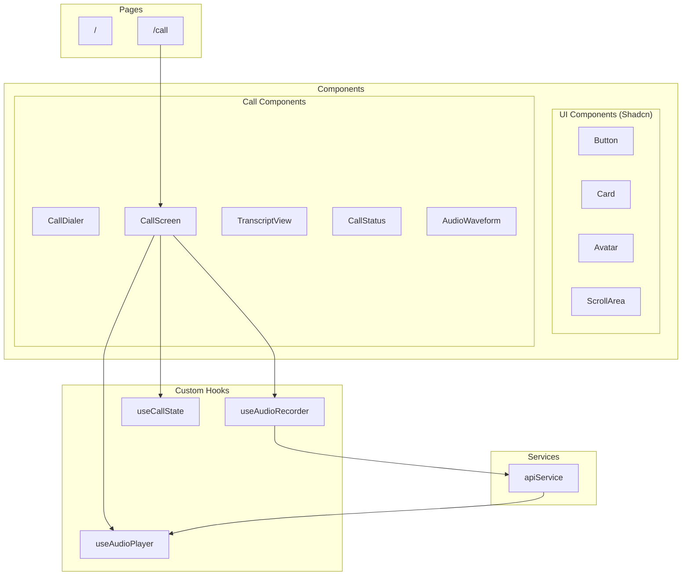
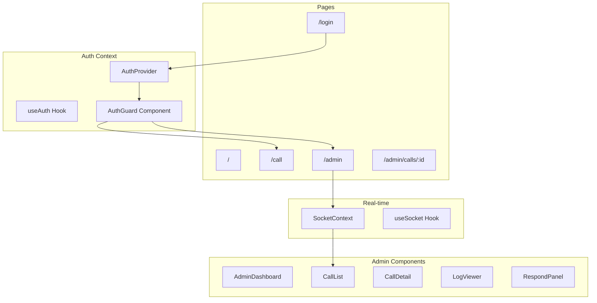

# Frontend Implementation Plan - AI Call Center

## Tổng quan

Xây dựng Frontend Next.js cho hệ thống AI Call Center với các tính năng:

-   Giao diện gọi điện mô phỏng cuộc gọi thực
-   Thu âm giọng nói từ microphone
-   Phát audio phản hồi từ AI
-   Hiển thị transcript cuộc hội thoại
-   Real-time trạng thái cuộc gọi

---

## Kiến trúc Frontend



---

## Cấu trúc thư mục

```
frontend/
├── src/
│   ├── app/
│   │   ├── layout.tsx              # Root layout
│   │   ├── page.tsx                # Homepage
│   │   ├── call/
│   │   │   └── page.tsx            # Call page
│   │   └── globals.css             # Global styles
│   │
│   ├── components/
│   │   ├── ui/                     # Shadcn UI components
│   │   │   ├── button.tsx
│   │   │   ├── card.tsx
│   │   │   ├── avatar.tsx
│   │   │   ├── scroll-area.tsx
│   │   │   └── ...
│   │   │
│   │   └── call/                   # Call-related components
│   │       ├── CallDialer.tsx      # Nút bắt đầu gọi
│   │       ├── CallScreen.tsx      # Màn hình cuộc gọi chính
│   │       ├── CallStatus.tsx      # Hiển thị trạng thái
│   │       ├── TranscriptView.tsx  # Hiển thị hội thoại
│   │       ├── AudioWaveform.tsx   # Visualize audio
│   │       └── index.ts            # Export barrel
│   │
│   ├── hooks/
│   │   ├── useAudioRecorder.ts     # Hook thu âm
│   │   ├── useAudioPlayer.ts       # Hook phát audio
│   │   ├── useCallState.ts         # Hook quản lý trạng thái
│   │   └── index.ts
│   │
│   ├── services/
│   │   └── api.ts                  # API service layer
│   │
│   ├── types/
│   │   └── index.ts                # TypeScript types
│   │
│   └── lib/
│       └── utils.ts                # Utility functions
│
├── public/
│   ├── sounds/
│   │   ├── ring.mp3                # Ringtone
│   │   └── end-call.mp3            # End call sound
│   └── icons/
│       └── ...
│
├── .env.local                      # Environment variables
├── next.config.js
├── tailwind.config.ts
├── tsconfig.json
└── package.json
```

---

## Chi tiết Implementation

### Phase 1: Project Setup

#### 1.1. Khởi tạo Next.js Project

```bash
npx create-next-app@latest frontend --typescript --tailwind --eslint --app --src-dir --import-alias "@/*"
cd frontend
```

#### 1.2. Cài đặt Dependencies

**[MODIFY] `frontend/package.json`**

```json
{
    "dependencies": {
        "next": "14.0.4",
        "react": "^18",
        "react-dom": "^18",
        "class-variance-authority": "^0.7.0",
        "clsx": "^2.0.0",
        "tailwind-merge": "^2.2.0",
        "lucide-react": "^0.303.0",
        "@radix-ui/react-avatar": "^1.0.4",
        "@radix-ui/react-scroll-area": "^1.0.5",
        "@radix-ui/react-slot": "^1.0.2"
    }
}
```

```bash
npm install
npx shadcn-ui@latest init
npx shadcn-ui@latest add button card avatar scroll-area
```

#### 1.3. Environment Configuration

**[NEW] `frontend/.env.local`**

```env
NEXT_PUBLIC_API_URL=http://localhost:3724
```

---

### Phase 2: Types Definition

**[NEW] `frontend/src/types/index.ts`**

```typescript
// Call States
export type CallState =
    | "idle" // Chưa gọi
    | "connecting" // Đang kết nối
    | "active" // Đang trong cuộc gọi
    | "listening" // Đang nghe user nói
    | "processing" // Đang xử lý (STT + RAG + LLM)
    | "speaking" // AI đang nói
    | "ended"; // Cuộc gọi kết thúc

// Transcript Message
export interface TranscriptMessage {
    id: string;
    role: "user" | "assistant";
    content: string;
    timestamp: Date;
    audioUrl?: string;
}

// API Response
export interface ChatResponse {
    response: string;
    sources?: string[];
}

// Audio Recorder State
export interface AudioRecorderState {
    isRecording: boolean;
    audioBlob: Blob | null;
    audioUrl: string | null;
    error: string | null;
}

// Audio Player State
export interface AudioPlayerState {
    isPlaying: boolean;
    currentTime: number;
    duration: number;
}
```

---

### Phase 3: Custom Hooks

#### 3.1. useAudioRecorder Hook

**[NEW] `frontend/src/hooks/useAudioRecorder.ts`**

Hook để thu âm từ microphone sử dụng Web Audio API và MediaRecorder.

```typescript
import { useState, useRef, useCallback } from "react";

interface UseAudioRecorderReturn {
    isRecording: boolean;
    audioBlob: Blob | null;
    startRecording: () => Promise<void>;
    stopRecording: () => Promise<Blob>;
    error: string | null;
}

export function useAudioRecorder(): UseAudioRecorderReturn {
    const [isRecording, setIsRecording] = useState(false);
    const [audioBlob, setAudioBlob] = useState<Blob | null>(null);
    const [error, setError] = useState<string | null>(null);

    const mediaRecorderRef = useRef<MediaRecorder | null>(null);
    const chunksRef = useRef<Blob[]>([]);

    const startRecording = useCallback(async () => {
        try {
            setError(null);
            chunksRef.current = [];

            const stream = await navigator.mediaDevices.getUserMedia({
                audio: {
                    echoCancellation: true,
                    noiseSuppression: true,
                    sampleRate: 16000,
                },
            });

            const mediaRecorder = new MediaRecorder(stream, {
                mimeType: "audio/webm;codecs=opus",
            });

            mediaRecorder.ondataavailable = (event) => {
                if (event.data.size > 0) {
                    chunksRef.current.push(event.data);
                }
            };

            mediaRecorderRef.current = mediaRecorder;
            mediaRecorder.start(100); // Collect data every 100ms
            setIsRecording(true);
        } catch (err) {
            setError("Không thể truy cập microphone. Vui lòng cho phép quyền truy cập.");
            console.error("Error starting recording:", err);
        }
    }, []);

    const stopRecording = useCallback(async (): Promise<Blob> => {
        return new Promise((resolve, reject) => {
            if (!mediaRecorderRef.current) {
                reject(new Error("No recording in progress"));
                return;
            }

            mediaRecorderRef.current.onstop = () => {
                const blob = new Blob(chunksRef.current, { type: "audio/webm" });
                setAudioBlob(blob);
                setIsRecording(false);

                // Stop all tracks
                mediaRecorderRef.current?.stream.getTracks().forEach((track) => track.stop());

                resolve(blob);
            };

            mediaRecorderRef.current.stop();
        });
    }, []);

    return {
        isRecording,
        audioBlob,
        startRecording,
        stopRecording,
        error,
    };
}
```

#### 3.2. useAudioPlayer Hook

**[NEW] `frontend/src/hooks/useAudioPlayer.ts`**

Hook để phát audio response từ AI.

```typescript
import { useState, useRef, useCallback, useEffect } from "react";

interface UseAudioPlayerReturn {
    isPlaying: boolean;
    currentTime: number;
    duration: number;
    play: (audioBlob: Blob) => Promise<void>;
    stop: () => void;
    onEnded: (callback: () => void) => void;
}

export function useAudioPlayer(): UseAudioPlayerReturn {
    const [isPlaying, setIsPlaying] = useState(false);
    const [currentTime, setCurrentTime] = useState(0);
    const [duration, setDuration] = useState(0);

    const audioRef = useRef<HTMLAudioElement | null>(null);
    const onEndedCallbackRef = useRef<(() => void) | null>(null);

    useEffect(() => {
        audioRef.current = new Audio();

        audioRef.current.onended = () => {
            setIsPlaying(false);
            setCurrentTime(0);
            onEndedCallbackRef.current?.();
        };

        audioRef.current.ontimeupdate = () => {
            setCurrentTime(audioRef.current?.currentTime || 0);
        };

        audioRef.current.onloadedmetadata = () => {
            setDuration(audioRef.current?.duration || 0);
        };

        return () => {
            audioRef.current?.pause();
            audioRef.current = null;
        };
    }, []);

    const play = useCallback(async (audioBlob: Blob) => {
        if (!audioRef.current) return;

        const url = URL.createObjectURL(audioBlob);
        audioRef.current.src = url;

        try {
            await audioRef.current.play();
            setIsPlaying(true);
        } catch (err) {
            console.error("Error playing audio:", err);
        }
    }, []);

    const stop = useCallback(() => {
        if (!audioRef.current) return;
        audioRef.current.pause();
        audioRef.current.currentTime = 0;
        setIsPlaying(false);
    }, []);

    const onEnded = useCallback((callback: () => void) => {
        onEndedCallbackRef.current = callback;
    }, []);

    return {
        isPlaying,
        currentTime,
        duration,
        play,
        stop,
        onEnded,
    };
}
```

#### 3.3. useCallState Hook

**[NEW] `frontend/src/hooks/useCallState.ts`**

Hook quản lý trạng thái cuộc gọi và orchestrate các hooks khác.

```typescript
import { useState, useCallback, useRef } from "react";
import { CallState, TranscriptMessage } from "@/types";
import { useAudioRecorder } from "./useAudioRecorder";
import { useAudioPlayer } from "./useAudioPlayer";
import { sendVoiceMessage } from "@/services/api";

interface UseCallStateReturn {
    callState: CallState;
    transcript: TranscriptMessage[];
    error: string | null;
    startCall: () => void;
    endCall: () => void;
    toggleRecording: () => void;
    isRecording: boolean;
    isProcessing: boolean;
}

export function useCallState(): UseCallStateReturn {
    const [callState, setCallState] = useState<CallState>("idle");
    const [transcript, setTranscript] = useState<TranscriptMessage[]>([]);
    const [error, setError] = useState<string | null>(null);

    const { isRecording, startRecording, stopRecording } = useAudioRecorder();
    const { play, stop: stopAudio, onEnded } = useAudioPlayer();

    const isProcessingRef = useRef(false);

    const addMessage = useCallback((role: "user" | "assistant", content: string) => {
        setTranscript((prev) => [
            ...prev,
            {
                id: Date.now().toString(),
                role,
                content,
                timestamp: new Date(),
            },
        ]);
    }, []);

    const startCall = useCallback(() => {
        setCallState("connecting");
        setTranscript([]);

        // Simulate connection delay
        setTimeout(() => {
            setCallState("active");
            addMessage("assistant", "Xin chào! Tôi là trợ lý AI của cửa hàng. Tôi có thể giúp gì cho bạn?");
        }, 1000);
    }, [addMessage]);

    const endCall = useCallback(() => {
        stopAudio();
        setCallState("ended");
        setTimeout(() => setCallState("idle"), 2000);
    }, [stopAudio]);

    const processVoiceInput = useCallback(
        async (audioBlob: Blob) => {
            if (isProcessingRef.current) return;

            isProcessingRef.current = true;
            setCallState("processing");

            try {
                const response = await sendVoiceMessage(audioBlob);

                // Add user message (from X-Transcription header)
                if (response.transcription) {
                    addMessage("user", response.transcription);
                }

                // Add AI response text
                if (response.responseText) {
                    addMessage("assistant", response.responseText);
                }

                // Play audio response
                if (response.audioBlob) {
                    setCallState("speaking");
                    await play(response.audioBlob);
                }
            } catch (err) {
                setError("Có lỗi xảy ra. Vui lòng thử lại.");
                console.error("Voice processing error:", err);
            } finally {
                isProcessingRef.current = false;
                setCallState("active");
            }
        },
        [addMessage, play]
    );

    // Set up audio ended handler
    onEnded(() => {
        if (callState === "speaking") {
            setCallState("active");
        }
    });

    const toggleRecording = useCallback(async () => {
        if (isRecording) {
            const blob = await stopRecording();
            await processVoiceInput(blob);
        } else {
            setCallState("listening");
            await startRecording();
        }
    }, [isRecording, startRecording, stopRecording, processVoiceInput]);

    return {
        callState,
        transcript,
        error,
        startCall,
        endCall,
        toggleRecording,
        isRecording,
        isProcessing: callState === "processing",
    };
}
```

---

### Phase 4: API Service Layer

**[NEW] `frontend/src/services/api.ts`**

```typescript
const API_URL = process.env.NEXT_PUBLIC_API_URL || "http://localhost:3724";

export interface VoiceResponse {
    audioBlob: Blob;
    transcription?: string;
    responseText?: string;
}

export interface ChatResponse {
    response: string;
    sources?: string[];
}

/**
 * Send voice message to backend and get audio response
 */
export async function sendVoiceMessage(audioBlob: Blob): Promise<VoiceResponse> {
    const formData = new FormData();
    formData.append("audio", audioBlob, "recording.webm");

    const response = await fetch(`${API_URL}/api/voice`, {
        method: "POST",
        body: formData,
    });

    if (!response.ok) {
        throw new Error(`Voice API error: ${response.status}`);
    }

    const responseBlob = await response.blob();
    const transcription = response.headers.get("X-Transcription") || undefined;
    const responseText = response.headers.get("X-Response-Text") || undefined;

    return {
        audioBlob: responseBlob,
        transcription: transcription ? decodeURIComponent(transcription) : undefined,
        responseText: responseText ? decodeURIComponent(responseText) : undefined,
    };
}

/**
 * Send text message and get text response
 */
export async function sendChatMessage(message: string): Promise<ChatResponse> {
    const response = await fetch(`${API_URL}/api/chat`, {
        method: "POST",
        headers: {
            "Content-Type": "application/json",
        },
        body: JSON.stringify({ message }),
    });

    if (!response.ok) {
        throw new Error(`Chat API error: ${response.status}`);
    }

    return response.json();
}

/**
 * Check backend health
 */
export async function checkHealth(): Promise<boolean> {
    try {
        const response = await fetch(`${API_URL}/api/health`);
        const data = await response.json();
        return data.status === "ok";
    } catch {
        return false;
    }
}
```

---

### Phase 5: UI Components

#### 5.1. CallDialer Component

**[NEW] `frontend/src/components/call/CallDialer.tsx`**

Màn hình chào mừng với nút bắt đầu cuộc gọi.

```tsx
"use client";

import { Phone } from "lucide-react";
import { Button } from "@/components/ui/button";
import { Card, CardContent, CardHeader, CardTitle } from "@/components/ui/card";

interface CallDialerProps {
    onStartCall: () => void;
    isConnecting?: boolean;
}

export function CallDialer({ onStartCall, isConnecting }: CallDialerProps) {
    return (
        <Card className="w-full max-w-md mx-auto">
            <CardHeader className="text-center">
                <div className="mx-auto w-20 h-20 bg-gradient-to-br from-green-400 to-green-600 rounded-full flex items-center justify-center mb-4">
                    <Phone className="w-10 h-10 text-white" />
                </div>
                <CardTitle className="text-2xl">AI Call Center</CardTitle>
                <p className="text-muted-foreground">Trợ lý chăm sóc khách hàng AI</p>
            </CardHeader>
            <CardContent className="text-center space-y-4">
                <p className="text-sm text-muted-foreground">
                    Nhấn nút bên dưới để bắt đầu cuộc gọi với trợ lý AI. Bạn có thể hỏi về sản phẩm, chính sách hoặc các câu hỏi thường gặp.
                </p>
                <Button size="lg" className="w-full bg-green-500 hover:bg-green-600" onClick={onStartCall} disabled={isConnecting}>
                    {isConnecting ? (
                        <>
                            <span className="animate-pulse">Đang kết nối...</span>
                        </>
                    ) : (
                        <>
                            <Phone className="mr-2 h-5 w-5" />
                            Bắt đầu cuộc gọi
                        </>
                    )}
                </Button>
            </CardContent>
        </Card>
    );
}
```

#### 5.2. CallScreen Component

**[NEW] `frontend/src/components/call/CallScreen.tsx`**

Màn hình cuộc gọi chính.

```tsx
"use client";

import { PhoneOff, Mic, MicOff, Loader2 } from "lucide-react";
import { Button } from "@/components/ui/button";
import { Card } from "@/components/ui/card";
import { Avatar, AvatarFallback } from "@/components/ui/avatar";
import { CallStatus } from "./CallStatus";
import { TranscriptView } from "./TranscriptView";
import { AudioWaveform } from "./AudioWaveform";
import { CallState, TranscriptMessage } from "@/types";

interface CallScreenProps {
    callState: CallState;
    transcript: TranscriptMessage[];
    isRecording: boolean;
    onToggleRecording: () => void;
    onEndCall: () => void;
}

export function CallScreen({ callState, transcript, isRecording, onToggleRecording, onEndCall }: CallScreenProps) {
    const isActive = callState !== "ended";

    return (
        <Card className="w-full max-w-md mx-auto overflow-hidden">
            {/* Header - AI Avatar and Status */}
            <div className="bg-gradient-to-br from-blue-500 to-purple-600 p-6 text-center text-white">
                <Avatar className="w-24 h-24 mx-auto mb-4 border-4 border-white/30">
                    <AvatarFallback className="bg-white/20 text-3xl">AI</AvatarFallback>
                </Avatar>
                <h2 className="text-xl font-semibold">Trợ lý AI</h2>
                <CallStatus state={callState} />

                {/* Audio Waveform Visualization */}
                {(isRecording || callState === "speaking") && (
                    <div className="mt-4">
                        <AudioWaveform isActive={isRecording || callState === "speaking"} />
                    </div>
                )}
            </div>

            {/* Transcript Area */}
            <div className="h-64 overflow-hidden">
                <TranscriptView messages={transcript} />
            </div>

            {/* Control Buttons */}
            <div className="p-4 bg-gray-50 dark:bg-gray-900 flex justify-center gap-4">
                {/* Mic Button */}
                <Button
                    size="lg"
                    variant={isRecording ? "destructive" : "default"}
                    className={`w-16 h-16 rounded-full ${isRecording ? "bg-red-500 hover:bg-red-600 animate-pulse" : "bg-blue-500 hover:bg-blue-600"}`}
                    onClick={onToggleRecording}
                    disabled={callState === "processing" || callState === "speaking"}
                >
                    {callState === "processing" ? (
                        <Loader2 className="h-6 w-6 animate-spin" />
                    ) : isRecording ? (
                        <MicOff className="h-6 w-6" />
                    ) : (
                        <Mic className="h-6 w-6" />
                    )}
                </Button>

                {/* End Call Button */}
                <Button size="lg" variant="destructive" className="w-16 h-16 rounded-full" onClick={onEndCall} disabled={!isActive}>
                    <PhoneOff className="h-6 w-6" />
                </Button>
            </div>
        </Card>
    );
}
```

#### 5.3. CallStatus Component

**[NEW] `frontend/src/components/call/CallStatus.tsx`**

Hiển thị trạng thái cuộc gọi.

```tsx
import { CallState } from "@/types";

interface CallStatusProps {
    state: CallState;
}

const STATUS_TEXT: Record<CallState, string> = {
    idle: "",
    connecting: "Đang kết nối...",
    active: "Đang hoạt động",
    listening: "Đang nghe...",
    processing: "Đang xử lý...",
    speaking: "AI đang trả lời...",
    ended: "Cuộc gọi đã kết thúc",
};

const STATUS_COLOR: Record<CallState, string> = {
    idle: "text-gray-400",
    connecting: "text-yellow-300",
    active: "text-green-300",
    listening: "text-blue-300",
    processing: "text-yellow-300",
    speaking: "text-purple-300",
    ended: "text-red-300",
};

export function CallStatus({ state }: CallStatusProps) {
    return (
        <div className={`flex items-center justify-center gap-2 mt-2 ${STATUS_COLOR[state]}`}>
            {state !== "idle" && state !== "ended" && (
                <span className="relative flex h-2 w-2">
                    <span className="animate-ping absolute inline-flex h-full w-full rounded-full bg-current opacity-75"></span>
                    <span className="relative inline-flex rounded-full h-2 w-2 bg-current"></span>
                </span>
            )}
            <span className="text-sm">{STATUS_TEXT[state]}</span>
        </div>
    );
}
```

#### 5.4. TranscriptView Component

**[NEW] `frontend/src/components/call/TranscriptView.tsx`**

Hiển thị transcript cuộc hội thoại.

```tsx
import { useEffect, useRef } from "react";
import { ScrollArea } from "@/components/ui/scroll-area";
import { TranscriptMessage } from "@/types";
import { cn } from "@/lib/utils";

interface TranscriptViewProps {
    messages: TranscriptMessage[];
}

export function TranscriptView({ messages }: TranscriptViewProps) {
    const scrollRef = useRef<HTMLDivElement>(null);

    // Auto-scroll to bottom when new messages arrive
    useEffect(() => {
        if (scrollRef.current) {
            scrollRef.current.scrollTop = scrollRef.current.scrollHeight;
        }
    }, [messages]);

    if (messages.length === 0) {
        return (
            <div className="h-full flex items-center justify-center text-muted-foreground">
                <p className="text-sm">Cuộc hội thoại sẽ hiển thị ở đây</p>
            </div>
        );
    }

    return (
        <ScrollArea className="h-full p-4" ref={scrollRef}>
            <div className="space-y-4">
                {messages.map((message) => (
                    <div key={message.id} className={cn("flex", message.role === "user" ? "justify-end" : "justify-start")}>
                        <div
                            className={cn(
                                "max-w-[80%] rounded-2xl px-4 py-2 text-sm",
                                message.role === "user" ? "bg-blue-500 text-white rounded-br-md" : "bg-gray-100 dark:bg-gray-800 text-foreground rounded-bl-md"
                            )}
                        >
                            {message.content}
                        </div>
                    </div>
                ))}
            </div>
        </ScrollArea>
    );
}
```

#### 5.5. AudioWaveform Component

**[NEW] `frontend/src/components/call/AudioWaveform.tsx`**

Visualize audio waveform khi đang thu âm hoặc phát.

```tsx
interface AudioWaveformProps {
    isActive: boolean;
}

export function AudioWaveform({ isActive }: AudioWaveformProps) {
    return (
        <div className="flex items-center justify-center gap-1 h-8">
            {Array.from({ length: 5 }).map((_, i) => (
                <div
                    key={i}
                    className={`w-1 bg-white/80 rounded-full transition-all duration-150 ${isActive ? "animate-waveform" : "h-1"}`}
                    style={{
                        animationDelay: `${i * 100}ms`,
                        height: isActive ? undefined : "4px",
                    }}
                />
            ))}
        </div>
    );
}
```

**Thêm CSS animation cho waveform trong `globals.css`:**

```css
@keyframes waveform {
    0%,
    100% {
        height: 4px;
    }
    50% {
        height: 24px;
    }
}

.animate-waveform {
    animation: waveform 0.5s ease-in-out infinite;
}
```

---

### Phase 6: Pages

#### 6.1. Homepage

**[NEW] `frontend/src/app/page.tsx`**

```tsx
import Link from "next/link";
import { Button } from "@/components/ui/button";
import { Phone, MessageSquare, HelpCircle } from "lucide-react";

export default function Home() {
    return (
        <main className="min-h-screen bg-gradient-to-br from-gray-900 via-blue-900 to-purple-900">
            <div className="container mx-auto px-4 py-16">
                {/* Hero Section */}
                <div className="text-center mb-16">
                    <h1 className="text-5xl font-bold text-white mb-4">AI Call Center</h1>
                    <p className="text-xl text-gray-300 max-w-2xl mx-auto">
                        Trợ lý chăm sóc khách hàng AI thông minh. Trả lời mọi câu hỏi về sản phẩm, chính sách và hỗ trợ 24/7.
                    </p>
                </div>

                {/* CTA */}
                <div className="flex justify-center gap-4">
                    <Link href="/call">
                        <Button size="lg" className="bg-green-500 hover:bg-green-600">
                            <Phone className="mr-2 h-5 w-5" />
                            Gọi ngay
                        </Button>
                    </Link>
                </div>

                {/* Features */}
                <div className="grid md:grid-cols-3 gap-8 mt-16">
                    <div className="bg-white/10 backdrop-blur-lg rounded-xl p-6 text-center">
                        <Phone className="w-12 h-12 text-green-400 mx-auto mb-4" />
                        <h3 className="text-xl font-semibold text-white mb-2">Gọi điện AI</h3>
                        <p className="text-gray-300">Trò chuyện bằng giọng nói với AI theo thời gian thực</p>
                    </div>

                    <div className="bg-white/10 backdrop-blur-lg rounded-xl p-6 text-center">
                        <MessageSquare className="w-12 h-12 text-blue-400 mx-auto mb-4" />
                        <h3 className="text-xl font-semibold text-white mb-2">Trả lời thông minh</h3>
                        <p className="text-gray-300">AI hiểu và trả lời chính xác dựa trên kiến thức sản phẩm</p>
                    </div>

                    <div className="bg-white/10 backdrop-blur-lg rounded-xl p-6 text-center">
                        <HelpCircle className="w-12 h-12 text-purple-400 mx-auto mb-4" />
                        <h3 className="text-xl font-semibold text-white mb-2">Hỗ trợ 24/7</h3>
                        <p className="text-gray-300">Luôn sẵn sàng hỗ trợ mọi lúc, mọi nơi</p>
                    </div>
                </div>
            </div>
        </main>
    );
}
```

#### 6.2. Call Page

**[NEW] `frontend/src/app/call/page.tsx`**

```tsx
"use client";

import { useCallState } from "@/hooks/useCallState";
import { CallDialer } from "@/components/call/CallDialer";
import { CallScreen } from "@/components/call/CallScreen";

export default function CallPage() {
    const { callState, transcript, startCall, endCall, toggleRecording, isRecording } = useCallState();

    return (
        <main className="min-h-screen bg-gradient-to-br from-gray-900 via-blue-900 to-purple-900 flex items-center justify-center p-4">
            {callState === "idle" ? (
                <CallDialer onStartCall={startCall} isConnecting={false} />
            ) : (
                <CallScreen callState={callState} transcript={transcript} isRecording={isRecording} onToggleRecording={toggleRecording} onEndCall={endCall} />
            )}
        </main>
    );
}
```

---

### Phase 7: Global Layout & Styles

#### 7.1. Root Layout

**[MODIFY] `frontend/src/app/layout.tsx`**

```tsx
import type { Metadata } from "next";
import { Inter } from "next/font/google";
import "./globals.css";

const inter = Inter({ subsets: ["latin", "vietnamese"] });

export const metadata: Metadata = {
    title: "AI Call Center - Trợ lý chăm sóc khách hàng",
    description: "Hệ thống trợ lý chăm sóc khách hàng AI thông minh",
};

export default function RootLayout({ children }: { children: React.ReactNode }) {
    return (
        <html lang="vi">
            <body className={inter.className}>{children}</body>
        </html>
    );
}
```

#### 7.2. Global Styles

**[MODIFY] `frontend/src/app/globals.css`**

```css
@tailwind base;
@tailwind components;
@tailwind utilities;

@layer base {
    :root {
        --background: 0 0% 100%;
        --foreground: 222.2 84% 4.9%;
        --card: 0 0% 100%;
        --card-foreground: 222.2 84% 4.9%;
        --popover: 0 0% 100%;
        --popover-foreground: 222.2 84% 4.9%;
        --primary: 222.2 47.4% 11.2%;
        --primary-foreground: 210 40% 98%;
        --secondary: 210 40% 96.1%;
        --secondary-foreground: 222.2 47.4% 11.2%;
        --muted: 210 40% 96.1%;
        --muted-foreground: 215.4 16.3% 46.9%;
        --accent: 210 40% 96.1%;
        --accent-foreground: 222.2 47.4% 11.2%;
        --destructive: 0 84.2% 60.2%;
        --destructive-foreground: 210 40% 98%;
        --border: 214.3 31.8% 91.4%;
        --input: 214.3 31.8% 91.4%;
        --ring: 222.2 84% 4.9%;
        --radius: 0.5rem;
    }

    .dark {
        --background: 222.2 84% 4.9%;
        --foreground: 210 40% 98%;
        --card: 222.2 84% 4.9%;
        --card-foreground: 210 40% 98%;
        --popover: 222.2 84% 4.9%;
        --popover-foreground: 210 40% 98%;
        --primary: 210 40% 98%;
        --primary-foreground: 222.2 47.4% 11.2%;
        --secondary: 217.2 32.6% 17.5%;
        --secondary-foreground: 210 40% 98%;
        --muted: 217.2 32.6% 17.5%;
        --muted-foreground: 215 20.2% 65.1%;
        --accent: 217.2 32.6% 17.5%;
        --accent-foreground: 210 40% 98%;
        --destructive: 0 62.8% 30.6%;
        --destructive-foreground: 210 40% 98%;
        --border: 217.2 32.6% 17.5%;
        --input: 217.2 32.6% 17.5%;
        --ring: 212.7 26.8% 83.9%;
    }
}

@layer base {
    * {
        @apply border-border;
    }
    body {
        @apply bg-background text-foreground;
    }
}

/* Audio Waveform Animation */
@keyframes waveform {
    0%,
    100% {
        height: 4px;
    }
    50% {
        height: 24px;
    }
}

.animate-waveform {
    animation: waveform 0.5s ease-in-out infinite;
}

/* Smooth transitions */
* {
    transition-property: background-color, border-color, color, fill, stroke;
    transition-timing-function: cubic-bezier(0.4, 0, 0.2, 1);
    transition-duration: 150ms;
}
```

---

## Verification Plan

### Development Testing

```bash
cd frontend
npm run dev
# Open http://localhost:3000
```

### Test Cases

| Component      | Test Case                | Expected Result                                 |
| -------------- | ------------------------ | ----------------------------------------------- |
| CallDialer     | Click "Bắt đầu cuộc gọi" | Chuyển sang CallScreen, trạng thái "connecting" |
| CallScreen     | Click Mic button         | Bắt đầu thu âm, nút đổi màu đỏ                  |
| CallScreen     | Click Mic button again   | Dừng thu âm, gửi audio lên server               |
| CallScreen     | Click End Call           | Kết thúc cuộc gọi, quay về CallDialer           |
| TranscriptView | Receive messages         | Hiển thị đúng messages, auto-scroll             |
| AudioWaveform  | Recording/Speaking       | Animation waveform hoạt động                    |

### Browser Testing

Sử dụng browser subagent để test:

1. **Navigation Test:**

    - Mở http://localhost:3000
    - Verify homepage hiển thị đúng
    - Click "Gọi ngay" → verify chuyển đến /call

2. **Call Flow Test:**

    - Click "Bắt đầu cuộc gọi"
    - Verify trạng thái "connecting" → "active"
    - Click Mic → verify recording indicator
    - Click End Call → verify trở về idle

3. **Responsive Test:**
    - Test trên các viewport: mobile (375px), tablet (768px), desktop (1024px)

### Manual Verification

1. **Microphone Permission:**

    - Verify browser yêu cầu permission khi bắt đầu gọi
    - Verify error message khi từ chối permission

2. **Audio Playback:**

    - Verify AI response audio phát đúng
    - Verify transcript hiển thị đúng

3. **UI/UX:**
    - Verify animations smooth
    - Verify trạng thái hiển thị đúng
    - Verify responsive trên mobile

---

## Dependencies Summary

```json
{
    "dependencies": {
        "next": "14.0.4",
        "react": "^18",
        "react-dom": "^18",
        "class-variance-authority": "^0.7.0",
        "clsx": "^2.0.0",
        "tailwind-merge": "^2.2.0",
        "lucide-react": "^0.303.0",
        "@radix-ui/react-avatar": "^1.0.4",
        "@radix-ui/react-scroll-area": "^1.0.5",
        "@radix-ui/react-slot": "^1.0.2"
    },
    "devDependencies": {
        "typescript": "^5",
        "@types/node": "^20",
        "@types/react": "^18",
        "@types/react-dom": "^18",
        "autoprefixer": "^10.0.1",
        "postcss": "^8",
        "tailwindcss": "^3.3.0",
        "eslint": "^8",
        "eslint-config-next": "14.0.4"
    }
}
```

---

## Error Handling

| Error                 | Component        | Handling                                    |
| --------------------- | ---------------- | ------------------------------------------- |
| Microphone denied     | useAudioRecorder | Hiển thị error message, disable recording   |
| API Error             | useCallState     | Hiển thị toast/alert, giữ trạng thái active |
| Audio playback failed | useAudioPlayer   | Log error, tiếp tục cuộc gọi                |
| Network disconnected  | api.ts           | Retry với exponential backoff               |

---

## Performance Considerations

1. **Audio Compression:** Sử dụng WebM/Opus để giảm kích thước audio
2. **Lazy Loading:** Chỉ load CallScreen component khi cần
3. **Memoization:** React.memo cho components không thay đổi thường xuyên
4. **Web Workers:** Xem xét sử dụng Web Worker cho audio processing

---

## Phase 8: Authentication & Admin Features

### 8.1. Tổng quan tính năng mới

| Tính năng                | Mô tả                                             |
| ------------------------ | ------------------------------------------------- |
| **Login Page**           | Trang đăng nhập cho khách và admin                |
| **Admin Dashboard**      | Dashboard để admin quản lý và monitor cuộc gọi    |
| **Real-time Log Viewer** | Xem log cuộc gọi real-time qua WebSocket          |
| **Responder Indicator**  | Hiển thị người trả lời (AI/Admin) cho khách       |
| **Admin Takeover UI**    | Giao diện để admin tiếp nhận và phản hồi cuộc gọi |

### 8.2. Kiến trúc mở rộng



### 8.3. Cập nhật cấu trúc thư mục

```
frontend/src/
├── app/
│   ├── layout.tsx
│   ├── page.tsx
│   ├── login/
│   │   └── page.tsx               # [NEW] Login page
│   ├── call/
│   │   └── page.tsx
│   └── admin/
│       ├── layout.tsx             # [NEW] Admin layout
│       ├── page.tsx               # [NEW] Admin dashboard
│       └── calls/
│           └── [id]/
│               └── page.tsx       # [NEW] Call detail
│
├── components/
│   ├── auth/                      # [NEW] Auth components
│   │   ├── LoginForm.tsx
│   │   ├── AuthGuard.tsx
│   │   └── index.ts
│   ├── admin/                     # [NEW] Admin components
│   │   ├── AdminSidebar.tsx
│   │   ├── CallList.tsx
│   │   ├── CallDetail.tsx
│   │   ├── LogViewer.tsx
│   │   ├── RespondPanel.tsx
│   │   └── index.ts
│   └── call/
│       ├── ...
│       └── ResponderIndicator.tsx # [NEW]
│
├── contexts/                      # [NEW]
│   ├── AuthContext.tsx
│   └── SocketContext.tsx
│
├── hooks/
│   ├── ...
│   ├── useAuth.ts                 # [NEW]
│   └── useSocket.ts               # [NEW]
│
└── services/
    ├── api.ts
    ├── auth.ts                    # [NEW]
    └── socket.ts                  # [NEW]
```

### 8.4. Cập nhật Dependencies

**[MODIFY] `frontend/package.json`** - Thêm:

```json
{
    "dependencies": {
        "socket.io-client": "^4.7.2",
        "js-cookie": "^3.0.5",
        "@radix-ui/react-dialog": "^1.0.5",
        "@radix-ui/react-dropdown-menu": "^2.0.6",
        "@radix-ui/react-tabs": "^1.0.4",
        "@radix-ui/react-toast": "^1.1.5"
    },
    "devDependencies": {
        "@types/js-cookie": "^3.0.6"
    }
}
```

### 8.5. Types - Cập nhật

**[MODIFY] `frontend/src/types/index.ts`**

```typescript
// ... existing types ...

// User & Auth Types
export type UserRole = "guest" | "admin";

export interface User {
    id: string;
    username: string;
    role: UserRole;
    display_name: string;
}

export interface AuthState {
    user: User | null;
    token: string | null;
    isAuthenticated: boolean;
    isAdmin: boolean;
}

// Responder Type
export type ResponderType = "ai" | "admin";

// Updated Transcript Message
export interface TranscriptMessage {
    id: string;
    role: "user" | "assistant" | "admin";
    content: string;
    timestamp: Date;
    responder: ResponderType;
    audioUrl?: string;
}

// Call Session (for Admin)
export interface CallSession {
    id: string;
    guest_id: string;
    guest_name: string;
    status: "active" | "ended" | "admin_takeover";
    current_responder: ResponderType;
    admin_id?: string;
    messages: TranscriptMessage[];
    started_at: string;
    ended_at?: string;
}

// WebSocket Events
export interface SocketEvents {
    new_call: { session: CallSession };
    call_update: { session: CallSession };
    new_message: { session_id: string; message: TranscriptMessage };
    call_ended: { session_id: string };
    active_calls: { calls: CallSession[] };
}
```

### 8.6. Auth Service

**[NEW] `frontend/src/services/auth.ts`**

```typescript
import Cookies from "js-cookie";

const API_URL = process.env.NEXT_PUBLIC_API_URL || "http://localhost:3724";
const TOKEN_KEY = "auth_token";

export interface LoginResponse {
    token: string;
    user: {
        id: string;
        username: string;
        role: string;
        display_name: string;
    };
}

export async function login(username: string, password: string): Promise<LoginResponse> {
    const response = await fetch(`${API_URL}/api/auth/login`, {
        method: "POST",
        headers: { "Content-Type": "application/json" },
        body: JSON.stringify({ username, password }),
    });

    if (!response.ok) {
        const error = await response.json();
        throw new Error(error.error || "Login failed");
    }

    const data = await response.json();

    // Store token in cookie
    Cookies.set(TOKEN_KEY, data.token, { expires: 1 }); // 1 day

    return data;
}

export function logout(): void {
    Cookies.remove(TOKEN_KEY);
}

export function getToken(): string | undefined {
    return Cookies.get(TOKEN_KEY);
}

export async function getCurrentUser(): Promise<LoginResponse["user"] | null> {
    const token = getToken();
    if (!token) return null;

    try {
        const response = await fetch(`${API_URL}/api/auth/me`, {
            headers: { Authorization: `Bearer ${token}` },
        });

        if (!response.ok) return null;
        return response.json();
    } catch {
        return null;
    }
}

// Helper to add auth header to fetch requests
export function getAuthHeaders(): HeadersInit {
    const token = getToken();
    return token ? { Authorization: `Bearer ${token}` } : {};
}
```

### 8.7. Socket Service

**[NEW] `frontend/src/services/socket.ts`**

```typescript
import { io, Socket } from "socket.io-client";
import { getToken } from "./auth";

const SOCKET_URL = process.env.NEXT_PUBLIC_API_URL || "http://localhost:3724";

let socket: Socket | null = null;

export function connectSocket(): Socket {
    if (socket?.connected) return socket;

    socket = io(SOCKET_URL, {
        transports: ["websocket"],
        autoConnect: false,
    });

    socket.connect();

    return socket;
}

export function disconnectSocket(): void {
    socket?.disconnect();
    socket = null;
}

export function getSocket(): Socket | null {
    return socket;
}

export function joinAdminRoom(): void {
    const token = getToken();
    if (socket && token) {
        socket.emit("admin_join", { token });
    }
}

export function leaveAdminRoom(): void {
    socket?.emit("admin_leave");
}
```

### 8.8. Auth Context

**[NEW] `frontend/src/contexts/AuthContext.tsx`**

```tsx
"use client";

import { createContext, useContext, useState, useEffect, ReactNode } from "react";
import { User, AuthState } from "@/types";
import { login as loginApi, logout as logoutApi, getCurrentUser, getToken } from "@/services/auth";

interface AuthContextType extends AuthState {
    login: (username: string, password: string) => Promise<void>;
    logout: () => void;
    isLoading: boolean;
}

const AuthContext = createContext<AuthContextType | null>(null);

export function AuthProvider({ children }: { children: ReactNode }) {
    const [user, setUser] = useState<User | null>(null);
    const [isLoading, setIsLoading] = useState(true);

    useEffect(() => {
        // Check for existing session
        const initAuth = async () => {
            const token = getToken();
            if (token) {
                const userData = await getCurrentUser();
                if (userData) {
                    setUser(userData as User);
                }
            }
            setIsLoading(false);
        };
        initAuth();
    }, []);

    const login = async (username: string, password: string) => {
        const response = await loginApi(username, password);
        setUser(response.user as User);
    };

    const logout = () => {
        logoutApi();
        setUser(null);
    };

    const value: AuthContextType = {
        user,
        token: getToken() || null,
        isAuthenticated: !!user,
        isAdmin: user?.role === "admin",
        login,
        logout,
        isLoading,
    };

    return <AuthContext.Provider value={value}>{children}</AuthContext.Provider>;
}

export function useAuth(): AuthContextType {
    const context = useContext(AuthContext);
    if (!context) {
        throw new Error("useAuth must be used within AuthProvider");
    }
    return context;
}
```

### 8.9. Socket Context

**[NEW] `frontend/src/contexts/SocketContext.tsx`**

```tsx
"use client";

import { createContext, useContext, useEffect, useState, ReactNode } from "react";
import { Socket } from "socket.io-client";
import { CallSession, TranscriptMessage } from "@/types";
import { connectSocket, disconnectSocket, joinAdminRoom, getSocket } from "@/services/socket";
import { useAuth } from "./AuthContext";

interface SocketContextType {
    socket: Socket | null;
    isConnected: boolean;
    activeCalls: CallSession[];
    joinAdmin: () => void;
}

const SocketContext = createContext<SocketContextType | null>(null);

export function SocketProvider({ children }: { children: ReactNode }) {
    const { isAdmin, isAuthenticated } = useAuth();
    const [socket, setSocket] = useState<Socket | null>(null);
    const [isConnected, setIsConnected] = useState(false);
    const [activeCalls, setActiveCalls] = useState<CallSession[]>([]);

    useEffect(() => {
        if (isAuthenticated && isAdmin) {
            const socketInstance = connectSocket();
            setSocket(socketInstance);

            socketInstance.on("connect", () => {
                setIsConnected(true);
                joinAdminRoom();
            });

            socketInstance.on("disconnect", () => {
                setIsConnected(false);
            });

            socketInstance.on("active_calls", (data: { calls: CallSession[] }) => {
                setActiveCalls(data.calls);
            });

            socketInstance.on("new_call", (data: { session: CallSession }) => {
                setActiveCalls((prev) => [...prev, data.session]);
            });

            socketInstance.on("call_update", (data: { session: CallSession }) => {
                setActiveCalls((prev) => prev.map((call) => (call.id === data.session.id ? data.session : call)));
            });

            socketInstance.on("new_message", (data: { session_id: string; message: TranscriptMessage }) => {
                setActiveCalls((prev) => prev.map((call) => (call.id === data.session_id ? { ...call, messages: [...call.messages, data.message] } : call)));
            });

            socketInstance.on("call_ended", (data: { session_id: string }) => {
                setActiveCalls((prev) => prev.filter((call) => call.id !== data.session_id));
            });

            return () => {
                disconnectSocket();
            };
        }
    }, [isAuthenticated, isAdmin]);

    const joinAdmin = () => {
        joinAdminRoom();
    };

    return <SocketContext.Provider value={{ socket, isConnected, activeCalls, joinAdmin }}>{children}</SocketContext.Provider>;
}

export function useSocket(): SocketContextType {
    const context = useContext(SocketContext);
    if (!context) {
        throw new Error("useSocket must be used within SocketProvider");
    }
    return context;
}
```

### 8.10. Auth Guard Component

**[NEW] `frontend/src/components/auth/AuthGuard.tsx`**

```tsx
"use client";

import { useEffect } from "react";
import { useRouter } from "next/navigation";
import { useAuth } from "@/contexts/AuthContext";

interface AuthGuardProps {
    children: React.ReactNode;
    requireAdmin?: boolean;
}

export function AuthGuard({ children, requireAdmin = false }: AuthGuardProps) {
    const { isAuthenticated, isAdmin, isLoading } = useAuth();
    const router = useRouter();

    useEffect(() => {
        if (!isLoading) {
            if (!isAuthenticated) {
                router.push("/login");
            } else if (requireAdmin && !isAdmin) {
                router.push("/call");
            }
        }
    }, [isAuthenticated, isAdmin, isLoading, requireAdmin, router]);

    if (isLoading) {
        return (
            <div className="min-h-screen flex items-center justify-center">
                <div className="animate-spin rounded-full h-12 w-12 border-b-2 border-blue-500" />
            </div>
        );
    }

    if (!isAuthenticated || (requireAdmin && !isAdmin)) {
        return null;
    }

    return <>{children}</>;
}
```

### 8.11. Login Page

**[NEW] `frontend/src/app/login/page.tsx`**

```tsx
"use client";

import { useState } from "react";
import { useRouter } from "next/navigation";
import { useAuth } from "@/contexts/AuthContext";
import { Button } from "@/components/ui/button";
import { Card, CardContent, CardHeader, CardTitle } from "@/components/ui/card";
import { Input } from "@/components/ui/input";
import { Label } from "@/components/ui/label";
import { Phone, User, Lock } from "lucide-react";

export default function LoginPage() {
    const [username, setUsername] = useState("");
    const [password, setPassword] = useState("");
    const [error, setError] = useState("");
    const [isLoading, setIsLoading] = useState(false);

    const { login } = useAuth();
    const router = useRouter();

    const handleSubmit = async (e: React.FormEvent) => {
        e.preventDefault();
        setError("");
        setIsLoading(true);

        try {
            await login(username, password);
            // Redirect based on role
            const user = await import("@/services/auth").then((m) => m.getCurrentUser());
            if (user?.role === "admin") {
                router.push("/admin");
            } else {
                router.push("/call");
            }
        } catch (err) {
            setError(err instanceof Error ? err.message : "Đăng nhập thất bại");
        } finally {
            setIsLoading(false);
        }
    };

    return (
        <main className="min-h-screen bg-gradient-to-br from-gray-900 via-blue-900 to-purple-900 flex items-center justify-center p-4">
            <Card className="w-full max-w-md">
                <CardHeader className="text-center">
                    <div className="mx-auto w-16 h-16 bg-gradient-to-br from-blue-400 to-purple-600 rounded-full flex items-center justify-center mb-4">
                        <Phone className="w-8 h-8 text-white" />
                    </div>
                    <CardTitle className="text-2xl">AI Call Center</CardTitle>
                    <p className="text-muted-foreground">Đăng nhập để tiếp tục</p>
                </CardHeader>
                <CardContent>
                    <form onSubmit={handleSubmit} className="space-y-4">
                        {error && <div className="p-3 text-sm text-red-500 bg-red-50 dark:bg-red-900/20 rounded-md">{error}</div>}

                        <div className="space-y-2">
                            <Label htmlFor="username">Tên đăng nhập</Label>
                            <div className="relative">
                                <User className="absolute left-3 top-3 h-4 w-4 text-muted-foreground" />
                                <Input
                                    id="username"
                                    placeholder="guest hoặc admin"
                                    value={username}
                                    onChange={(e) => setUsername(e.target.value)}
                                    className="pl-10"
                                    required
                                />
                            </div>
                        </div>

                        <div className="space-y-2">
                            <Label htmlFor="password">Mật khẩu</Label>
                            <div className="relative">
                                <Lock className="absolute left-3 top-3 h-4 w-4 text-muted-foreground" />
                                <Input
                                    id="password"
                                    type="password"
                                    placeholder="••••••••"
                                    value={password}
                                    onChange={(e) => setPassword(e.target.value)}
                                    className="pl-10"
                                    required
                                />
                            </div>
                        </div>

                        <Button type="submit" className="w-full" disabled={isLoading}>
                            {isLoading ? "Đang đăng nhập..." : "Đăng nhập"}
                        </Button>

                        <div className="text-xs text-center text-muted-foreground mt-4">
                            <p>Demo accounts:</p>
                            <p>Khách: guest / guest123</p>
                            <p>Admin: admin / admin123</p>
                        </div>
                    </form>
                </CardContent>
            </Card>
        </main>
    );
}
```

### 8.12. Admin Dashboard

**[NEW] `frontend/src/app/admin/page.tsx`**

```tsx
"use client";

import { useSocket } from "@/contexts/SocketContext";
import { AuthGuard } from "@/components/auth/AuthGuard";
import { CallList } from "@/components/admin/CallList";
import { Card, CardContent, CardHeader, CardTitle } from "@/components/ui/card";
import { Phone, Users, Activity } from "lucide-react";

export default function AdminDashboard() {
    const { activeCalls, isConnected } = useSocket();

    return (
        <AuthGuard requireAdmin>
            <div className="min-h-screen bg-gray-100 dark:bg-gray-900">
                <header className="bg-white dark:bg-gray-800 shadow">
                    <div className="container mx-auto px-4 py-4">
                        <h1 className="text-2xl font-bold">Admin Dashboard</h1>
                        <div className="flex items-center gap-2 mt-1">
                            <span className={`h-2 w-2 rounded-full ${isConnected ? "bg-green-500" : "bg-red-500"}`} />
                            <span className="text-sm text-muted-foreground">{isConnected ? "Đã kết nối" : "Mất kết nối"}</span>
                        </div>
                    </div>
                </header>

                <main className="container mx-auto px-4 py-8">
                    {/* Stats Cards */}
                    <div className="grid grid-cols-1 md:grid-cols-3 gap-6 mb-8">
                        <Card>
                            <CardHeader className="flex flex-row items-center justify-between pb-2">
                                <CardTitle className="text-sm font-medium">Cuộc gọi đang hoạt động</CardTitle>
                                <Phone className="h-4 w-4 text-muted-foreground" />
                            </CardHeader>
                            <CardContent>
                                <div className="text-2xl font-bold">{activeCalls.length}</div>
                            </CardContent>
                        </Card>

                        <Card>
                            <CardHeader className="flex flex-row items-center justify-between pb-2">
                                <CardTitle className="text-sm font-medium">AI đang xử lý</CardTitle>
                                <Activity className="h-4 w-4 text-muted-foreground" />
                            </CardHeader>
                            <CardContent>
                                <div className="text-2xl font-bold">{activeCalls.filter((c) => c.current_responder === "ai").length}</div>
                            </CardContent>
                        </Card>

                        <Card>
                            <CardHeader className="flex flex-row items-center justify-between pb-2">
                                <CardTitle className="text-sm font-medium">Admin đang xử lý</CardTitle>
                                <Users className="h-4 w-4 text-muted-foreground" />
                            </CardHeader>
                            <CardContent>
                                <div className="text-2xl font-bold">{activeCalls.filter((c) => c.current_responder === "admin").length}</div>
                            </CardContent>
                        </Card>
                    </div>

                    {/* Active Calls */}
                    <Card>
                        <CardHeader>
                            <CardTitle>Cuộc gọi đang hoạt động</CardTitle>
                        </CardHeader>
                        <CardContent>
                            <CallList calls={activeCalls} />
                        </CardContent>
                    </Card>
                </main>
            </div>
        </AuthGuard>
    );
}
```

### 8.13. Call List Component

**[NEW] `frontend/src/components/admin/CallList.tsx`**

```tsx
"use client";

import Link from "next/link";
import { CallSession } from "@/types";
import { Button } from "@/components/ui/button";
import { Badge } from "@/components/ui/badge";
import { Eye, HandMetal, Bot, User } from "lucide-react";

interface CallListProps {
    calls: CallSession[];
}

export function CallList({ calls }: CallListProps) {
    if (calls.length === 0) {
        return <div className="text-center py-8 text-muted-foreground">Không có cuộc gọi nào đang hoạt động</div>;
    }

    return (
        <div className="space-y-4">
            {calls.map((call) => (
                <div key={call.id} className="flex items-center justify-between p-4 bg-gray-50 dark:bg-gray-800 rounded-lg">
                    <div className="flex items-center gap-4">
                        <div className="w-10 h-10 bg-blue-100 dark:bg-blue-900 rounded-full flex items-center justify-center">
                            <User className="h-5 w-5 text-blue-600 dark:text-blue-400" />
                        </div>
                        <div>
                            <h3 className="font-medium">{call.guest_name}</h3>
                            <p className="text-sm text-muted-foreground">
                                {call.messages.length} tin nhắn • Bắt đầu lúc {new Date(call.started_at).toLocaleTimeString("vi-VN")}
                            </p>
                        </div>
                    </div>

                    <div className="flex items-center gap-4">
                        <Badge variant={call.current_responder === "ai" ? "secondary" : "default"}>
                            {call.current_responder === "ai" ? (
                                <>
                                    <Bot className="h-3 w-3 mr-1" /> AI
                                </>
                            ) : (
                                <>
                                    <User className="h-3 w-3 mr-1" /> Admin
                                </>
                            )}
                        </Badge>

                        <Link href={`/admin/calls/${call.id}`}>
                            <Button variant="outline" size="sm">
                                <Eye className="h-4 w-4 mr-1" />
                                Xem
                            </Button>
                        </Link>

                        {call.current_responder === "ai" && (
                            <Button size="sm" className="bg-orange-500 hover:bg-orange-600">
                                <HandMetal className="h-4 w-4 mr-1" />
                                Tiếp nhận
                            </Button>
                        )}
                    </div>
                </div>
            ))}
        </div>
    );
}
```

### 8.14. Call Detail Page (Admin)

**[NEW] `frontend/src/app/admin/calls/[id]/page.tsx`**

```tsx
"use client";

import { useEffect, useState } from "react";
import { useParams, useRouter } from "next/navigation";
import { AuthGuard } from "@/components/auth/AuthGuard";
import { useSocket } from "@/contexts/SocketContext";
import { CallSession } from "@/types";
import { Button } from "@/components/ui/button";
import { Card, CardContent, CardHeader, CardTitle } from "@/components/ui/card";
import { Textarea } from "@/components/ui/textarea";
import { Badge } from "@/components/ui/badge";
import { ScrollArea } from "@/components/ui/scroll-area";
import { ArrowLeft, Send, Bot, User, HandMetal, Undo2 } from "lucide-react";
import { getAuthHeaders } from "@/services/auth";

const API_URL = process.env.NEXT_PUBLIC_API_URL || "http://localhost:3724";

export default function CallDetailPage() {
    const { id } = useParams();
    const router = useRouter();
    const { activeCalls } = useSocket();

    const [call, setCall] = useState<CallSession | null>(null);
    const [message, setMessage] = useState("");
    const [isSending, setIsSending] = useState(false);

    useEffect(() => {
        const foundCall = activeCalls.find((c) => c.id === id);
        if (foundCall) {
            setCall(foundCall);
        }
    }, [activeCalls, id]);

    const handleTakeover = async () => {
        try {
            await fetch(`${API_URL}/api/admin/takeover/${id}`, {
                method: "POST",
                headers: getAuthHeaders(),
            });
        } catch (error) {
            console.error("Takeover failed:", error);
        }
    };

    const handleRelease = async () => {
        try {
            await fetch(`${API_URL}/api/admin/release/${id}`, {
                method: "POST",
                headers: getAuthHeaders(),
            });
        } catch (error) {
            console.error("Release failed:", error);
        }
    };

    const handleSendMessage = async () => {
        if (!message.trim()) return;

        setIsSending(true);
        try {
            await fetch(`${API_URL}/api/admin/respond/${id}`, {
                method: "POST",
                headers: {
                    ...getAuthHeaders(),
                    "Content-Type": "application/json",
                },
                body: JSON.stringify({ message, send_voice: true }),
            });
            setMessage("");
        } catch (error) {
            console.error("Send failed:", error);
        } finally {
            setIsSending(false);
        }
    };

    if (!call) {
        return (
            <AuthGuard requireAdmin>
                <div className="min-h-screen flex items-center justify-center">
                    <p>Đang tải...</p>
                </div>
            </AuthGuard>
        );
    }

    return (
        <AuthGuard requireAdmin>
            <div className="min-h-screen bg-gray-100 dark:bg-gray-900">
                <header className="bg-white dark:bg-gray-800 shadow">
                    <div className="container mx-auto px-4 py-4 flex items-center gap-4">
                        <Button variant="ghost" size="sm" onClick={() => router.push("/admin")}>
                            <ArrowLeft className="h-4 w-4 mr-1" />
                            Quay lại
                        </Button>
                        <h1 className="text-xl font-bold">Cuộc gọi: {call.guest_name}</h1>
                        <Badge variant={call.current_responder === "ai" ? "secondary" : "default"}>
                            {call.current_responder === "ai" ? "AI đang xử lý" : "Admin đang xử lý"}
                        </Badge>
                    </div>
                </header>

                <main className="container mx-auto px-4 py-8">
                    <div className="grid grid-cols-1 lg:grid-cols-3 gap-6">
                        {/* Transcript */}
                        <Card className="lg:col-span-2">
                            <CardHeader>
                                <CardTitle>Nội dung cuộc gọi</CardTitle>
                            </CardHeader>
                            <CardContent>
                                <ScrollArea className="h-[500px] pr-4">
                                    <div className="space-y-4">
                                        {call.messages.map((msg) => (
                                            <div key={msg.id} className={`flex ${msg.role === "user" ? "justify-end" : "justify-start"}`}>
                                                <div
                                                    className={`max-w-[80%] rounded-lg px-4 py-2 ${
                                                        msg.role === "user"
                                                            ? "bg-blue-500 text-white"
                                                            : msg.role === "admin"
                                                            ? "bg-orange-500 text-white"
                                                            : "bg-gray-200 dark:bg-gray-700"
                                                    }`}
                                                >
                                                    <div className="flex items-center gap-1 text-xs opacity-75 mb-1">
                                                        {msg.responder === "ai" ? <Bot className="h-3 w-3" /> : <User className="h-3 w-3" />}
                                                        {msg.responder === "ai" ? "AI" : "Admin"}
                                                    </div>
                                                    <p>{msg.content}</p>
                                                </div>
                                            </div>
                                        ))}
                                    </div>
                                </ScrollArea>
                            </CardContent>
                        </Card>

                        {/* Control Panel */}
                        <Card>
                            <CardHeader>
                                <CardTitle>Điều khiển</CardTitle>
                            </CardHeader>
                            <CardContent className="space-y-4">
                                {call.current_responder === "ai" ? (
                                    <Button className="w-full bg-orange-500 hover:bg-orange-600" onClick={handleTakeover}>
                                        <HandMetal className="h-4 w-4 mr-2" />
                                        Tiếp nhận cuộc gọi
                                    </Button>
                                ) : (
                                    <>
                                        <Button variant="outline" className="w-full" onClick={handleRelease}>
                                            <Undo2 className="h-4 w-4 mr-2" />
                                            Trả về cho AI
                                        </Button>

                                        <div className="space-y-2">
                                            <Textarea
                                                placeholder="Nhập tin nhắn trả lời..."
                                                value={message}
                                                onChange={(e) => setMessage(e.target.value)}
                                                rows={4}
                                            />
                                            <Button className="w-full" onClick={handleSendMessage} disabled={!message.trim() || isSending}>
                                                <Send className="h-4 w-4 mr-2" />
                                                {isSending ? "Đang gửi..." : "Gửi phản hồi"}
                                            </Button>
                                        </div>
                                    </>
                                )}
                            </CardContent>
                        </Card>
                    </div>
                </main>
            </div>
        </AuthGuard>
    );
}
```

### 8.15. Responder Indicator Component

**[NEW] `frontend/src/components/call/ResponderIndicator.tsx`**

```tsx
import { ResponderType } from "@/types";
import { Bot, User } from "lucide-react";

interface ResponderIndicatorProps {
    responder: ResponderType;
    className?: string;
}

export function ResponderIndicator({ responder, className = "" }: ResponderIndicatorProps) {
    return (
        <div className={`flex items-center gap-2 ${className}`}>
            {responder === "ai" ? (
                <>
                    <div className="w-6 h-6 bg-blue-100 rounded-full flex items-center justify-center">
                        <Bot className="w-4 h-4 text-blue-600" />
                    </div>
                    <span className="text-sm">AI đang trả lời</span>
                </>
            ) : (
                <>
                    <div className="w-6 h-6 bg-orange-100 rounded-full flex items-center justify-center">
                        <User className="w-4 h-4 text-orange-600" />
                    </div>
                    <span className="text-sm">Nhân viên đang trả lời</span>
                </>
            )}
        </div>
    );
}
```

### 8.16. Cập nhật API Service

**[MODIFY] `frontend/src/services/api.ts`**

```typescript
import { getAuthHeaders } from "./auth";

const API_URL = process.env.NEXT_PUBLIC_API_URL || "http://localhost:3724";

export interface VoiceResponse {
    audioBlob: Blob;
    transcription?: string;
    responseText?: string;
    responder?: "ai" | "admin";
    sessionId?: string;
}

export async function sendVoiceMessage(audioBlob: Blob): Promise<VoiceResponse> {
    const formData = new FormData();
    formData.append("audio", audioBlob, "recording.webm");

    const response = await fetch(`${API_URL}/api/voice`, {
        method: "POST",
        headers: getAuthHeaders(),
        body: formData,
    });

    if (!response.ok) {
        throw new Error(`Voice API error: ${response.status}`);
    }

    const responseBlob = await response.blob();
    const transcription = response.headers.get("X-Transcription") || undefined;
    const responseText = response.headers.get("X-Response-Text") || undefined;
    const responder = response.headers.get("X-Responder") as "ai" | "admin" | undefined;
    const sessionId = response.headers.get("X-Session-Id") || undefined;

    return {
        audioBlob: responseBlob,
        transcription: transcription ? decodeURIComponent(transcription) : undefined,
        responseText: responseText ? decodeURIComponent(responseText) : undefined,
        responder,
        sessionId,
    };
}

// ... other functions with auth headers
```

### 8.17. Cập nhật Root Layout

**[MODIFY] `frontend/src/app/layout.tsx`**

```tsx
import type { Metadata } from "next";
import { Inter } from "next/font/google";
import "./globals.css";
import { AuthProvider } from "@/contexts/AuthContext";
import { SocketProvider } from "@/contexts/SocketContext";

const inter = Inter({ subsets: ["latin", "vietnamese"] });

export const metadata: Metadata = {
    title: "AI Call Center - Trợ lý chăm sóc khách hàng",
    description: "Hệ thống trợ lý chăm sóc khách hàng AI thông minh",
};

export default function RootLayout({ children }: { children: React.ReactNode }) {
    return (
        <html lang="vi">
            <body className={inter.className}>
                <AuthProvider>
                    <SocketProvider>{children}</SocketProvider>
                </AuthProvider>
            </body>
        </html>
    );
}
```

---

## Environment Variables - Updated

```env
NEXT_PUBLIC_API_URL=http://localhost:3724
```

---

## New Routes Summary

| Route               | Access      | Description        |
| ------------------- | ----------- | ------------------ |
| `/login`            | Public      | Trang đăng nhập    |
| `/call`             | Guest/Admin | Giao diện gọi điện |
| `/admin`            | Admin only  | Dashboard quản lý  |
| `/admin/calls/[id]` | Admin only  | Chi tiết cuộc gọi  |

---

## WebSocket Events Handled

| Event          | Handler       | Description             |
| -------------- | ------------- | ----------------------- |
| `connect`      | SocketContext | Kết nối thành công      |
| `disconnect`   | SocketContext | Mất kết nối             |
| `active_calls` | SocketContext | Nhận danh sách cuộc gọi |
| `new_call`     | SocketContext | Cuộc gọi mới            |
| `call_update`  | SocketContext | Cập nhật cuộc gọi       |
| `new_message`  | SocketContext | Tin nhắn mới            |
| `call_ended`   | SocketContext | Cuộc gọi kết thúc       |
