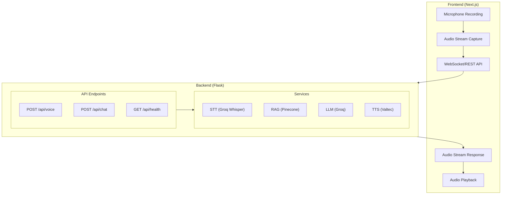
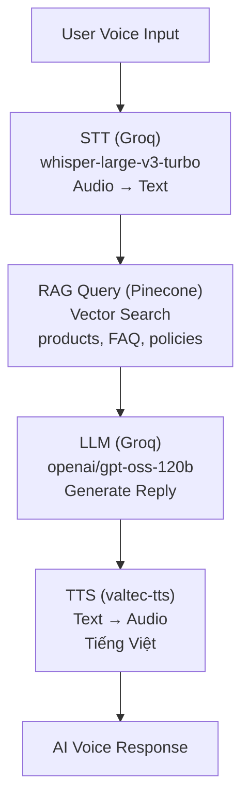

# AI Call Center - RAG Customer Support Demo

## 1. Tổng quan dự án

Xây dựng một **trang web demo AI RAG chăm sóc khách hàng** qua gọi điện trên giao diện web. Hệ thống cho phép người dùng trò chuyện bằng giọng nói theo thời gian thực với AI assistant, AI có khả năng truy xuất thông tin từ knowledge base (sản phẩm, FAQ, chính sách) để trả lời câu hỏi.

---

## 2. Kiến trúc hệ thống

### 2.1. Tech Stack

| Thành phần   | Công nghệ                                                                |
| ------------ | ------------------------------------------------------------------------ |
| **Frontend** | TypeScript, Next.js, TailwindCSS, Shadcn UI                              |
| **Backend**  | Python, Flask                                                            |
| **Database** | Pinecone (Vector Database cho RAG)                                       |
| **LLM**      | Groq - `openai/gpt-oss-120b`                                             |
| **STT**      | Groq - `whisper-large-v3-turbo`                                          |
| **TTS**      | [valtec-tts](https://github.com/tronghieuit/valtec-tts.git) (Tiếng Việt) |

### 2.2. Sơ đồ kiến trúc



---

## 3. Luồng hoạt động chi tiết

### 3.1. Voice Conversation Flow



### 3.2. Chi tiết từng bước

| Bước | Thành phần     | Input                 | Output             | API/Service                   |
| ---- | -------------- | --------------------- | ------------------ | ----------------------------- |
| 1    | Speech-to-Text | Audio file (WAV/WebM) | Transcribed text   | Groq `whisper-large-v3-turbo` |
| 2    | RAG Retrieval  | User query text       | Relevant documents | Pinecone Vector DB            |
| 3    | LLM Generation | Query + Context       | AI response text   | Groq `openai/gpt-oss-120b`    |
| 4    | Text-to-Speech | Response text         | Audio file         | valtec-tts                    |

---

## 4. Cấu trúc dữ liệu (Knowledge Base)

### 4.1. `data/product_details.json` - Thông tin sản phẩm

| Trường        | Kiểu dữ liệu | Ý nghĩa                                |
| ------------- | ------------ | -------------------------------------- |
| `id`          | `string`     | Mã định danh sản phẩm (lấy từ URL)     |
| `name`        | `string`     | Tên sản phẩm                           |
| `url`         | `string`     | Đường dẫn chi tiết sản phẩm            |
| `specs`       | `object`     | Thông số kỹ thuật `{key: value}`       |
| `variants`    | `array`      | Danh sách biến thể màu sắc và giá tiền |
| `description` | `string`     | Mô tả ngắn về sản phẩm                 |

**Ví dụ `variants`:**

```json
[
    { "color": "Đen", "price": "20.990.000₫" },
    { "color": "Trắng", "price": "21.990.000₫" }
]
```

---

### 4.2. `data/faq.json` - Câu hỏi thường gặp

| Trường     | Kiểu dữ liệu | Ý nghĩa                |
| ---------- | ------------ | ---------------------- |
| `question` | `string`     | Câu hỏi của khách hàng |
| `answer`   | `string`     | Câu trả lời tương ứng  |

---

### 4.3. `data/policy_dataset.json` - Chính sách

| Trường     | Kiểu dữ liệu | Ý nghĩa                                    |
| ---------- | ------------ | ------------------------------------------ |
| `category` | `string`     | Nhóm chính sách (VD: Bảo hành, Đổi trả...) |
| `title`    | `string`     | Tiêu đề mục chính sách                     |
| `content`  | `string`     | Nội dung chi tiết của mục chính sách       |

---

## 5. Yêu cầu chức năng

### 5.1. Frontend

-   [ ] **Giao diện gọi điện**: UI mô phỏng cuộc gọi với nút bắt đầu/kết thúc cuộc gọi
-   [ ] **Thu âm giọng nói**: Sử dụng Web Audio API để thu âm từ microphone
-   [ ] **Phát audio phản hồi**: Phát audio response từ AI
-   [ ] **Hiển thị transcript**: Hiển thị nội dung cuộc hội thoại (tuỳ chọn)
-   [ ] **Trạng thái real-time**: Hiển thị trạng thái (đang nghe, đang xử lý, đang trả lời)

### 5.2. Backend

-   [ ] **API Voice**: Endpoint nhận audio và trả về audio response
-   [ ] **STT Integration**: Tích hợp Groq Whisper để chuyển speech thành text
-   [ ] **RAG Pipeline**: Query Pinecone để retrieval context từ knowledge base
-   [ ] **LLM Integration**: Tích hợp Groq LLM để generate response
-   [ ] **TTS Integration**: Tích hợp valtec-tts để chuyển text thành speech
-   [ ] **Data Ingestion**: Script để index dữ liệu vào Pinecone

### 5.3. Real-time Processing

-   [ ] **Low latency**: Tối ưu để giảm độ trễ giữa câu hỏi và câu trả lời
-   [ ] **Streaming** (optional): Hỗ trợ streaming audio response

---

## 6. API Specification

### 6.1. Voice Endpoint

```
POST /api/voice
Content-Type: multipart/form-data

Request:
  - audio: File (WAV/WebM)

Response:
  Content-Type: audio/wav
  Body: Audio binary
```

### 6.2. Chat Endpoint (Text-based)

```
POST /api/chat
Content-Type: application/json

Request:
{
  "message": "string"
}

Response:
{
  "response": "string",
  "sources": ["string"]  // optional: cited sources
}
```

### 6.3. Health Check

```
GET /api/health

Response:
{
  "status": "ok",
  "services": {
    "pinecone": "connected",
    "groq": "connected",
    "tts": "available"
  }
}
```

---

## 7. Biến môi trường

```env
# Groq
GROQ_API_KEY=your_groq_api_key

# Pinecone
PINECONE_API_KEY=your_pinecone_api_key
PINECONE_INDEX_NAME=ai-call-center

# TTS Service
TTS_SERVICE_URL=http://localhost:3724  # hoặc URL của valtec-tts

# App Config
FLASK_ENV=development
FLASK_PORT=3724
NEXT_PUBLIC_API_URL=http://localhost:3724
```

---

## 8. Cấu trúc thư mục đề xuất

```
ai-call-center/
├── frontend/                    # Next.js Frontend
│   ├── src/
│   │   ├── app/                 # App Router
│   │   ├── components/          # React Components
│   │   │   ├── ui/              # Shadcn UI components
│   │   │   └── call/            # Call-related components
│   │   ├── hooks/               # Custom hooks (useAudioRecorder, etc.)
│   │   ├── lib/                 # Utilities
│   │   └── services/            # API services
│   ├── package.json
│   └── tailwind.config.js
│
├── backend/                     # Flask Backend
│   ├── app/
│   │   ├── __init__.py
│   │   ├── routes/              # API routes
│   │   ├── services/            # Business logic
│   │   │   ├── stt.py           # Speech-to-Text
│   │   │   ├── tts.py           # Text-to-Speech
│   │   │   ├── rag.py           # RAG pipeline
│   │   │   └── llm.py           # LLM integration
│   │   └── utils/               # Helpers
│   ├── requirements.txt
│   └── run.py
│
├── data/                        # Knowledge Base
│   ├── product_details.json
│   ├── faq.json
│   └── policy_dataset.json
│
├── scripts/                     # Utility scripts
│   └── ingest_data.py           # Index data to Pinecone
│
├── requirements.md              # This file
└── README.md
```

---

## 9. Tiêu chí hoàn thành

-   [ ] Demo có thể thực hiện cuộc gọi voice hoàn chỉnh (hỏi - đáp)
-   [ ] AI trả lời chính xác dựa trên knowledge base
-   [ ] Độ trễ chấp nhận được (< 3-5 giây cho full round-trip)
-   [ ] UI/UX thân thiện, dễ sử dụng
-   [ ] Code clean, có documentation
